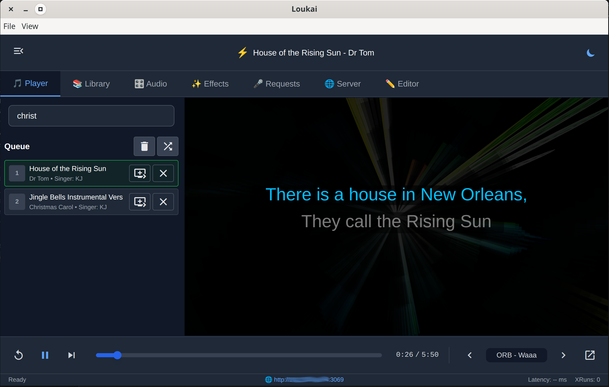

# Loukai

**A modern, real-time karaoke player with stem control, visual effects, and coaching features**

[](https://www.gnu.org/licenses/agpl-3.0)
[](https://react.dev/)
[](https://www.electronjs.org/)
[](./docs/PHASE2-SUMMARY.md)

Loukai is a cross-platform karaoke application built with Electron that supports multiple file formats (KAI, CDG, MP3+CDG pairs), real-time stem mixing, dual audio outputs, visual effects, and a web-based admin interface for remote control and song requests.



---

## Features

### Audio & Playback
- **Multi-Format Support**: M4A Stems (recommended), KAI files, CDG/MP3 pairs, and CDG archives (.kar, .zip)
- **Real-Time Stem Control**: Individual volume, mute, and solo controls for vocals, drums, bass, and other stems
- **Dual Output Routing**: Independent PA and IEM (in-ear monitor) outputs with per-stem routing
- **High-Quality Audio**: Web Audio API with real-time processing and pitch correction
- **Auto-Tune System**: Real-time pitch correction for microphone input
  - AudioWorklet processing (< 5ms latency)
  - Autocorrelation pitch detection (80-800 Hz vocal range)
  - Musical key support (12 major keys with scale snapping)
  - Adjustable strength and speed parameters
  - Phase vocoder architecture prepared for future enhancement
- **Queue Management**: Add, remove, reorder songs with drag-and-drop

### Visual Effects
- **Butterchurn Integration**: 200+ Milkdrop-style audio-reactive visualizations
- **CDG Graphics**: Classic karaoke graphics rendering with full format support
- **Canvas Window**: Dedicated fullscreen window for visuals with multi-monitor support
- **Lyric Display**: Real-time synchronized lyrics with customizable styling
- **QR Code Display**: Scannable QR code on canvas for easy mobile device connection (configurable)
- **Queue Display**: "Next up" overlay showing upcoming 1-3 songs with singer names (configurable)
- **Singer Identification**: Color-coded singer names (yellow for guests, white for KJ)

### Library & Search
- **Fast Library Scanning**: Automatic metadata extraction from thousands of songs
- **Multi-Format Support**: M4A Stems, KAI, CDG/MP3 pairs, and CDG archives
- **Smart Search**: Fuzzy search across titles, artists, and albums
- **Alphabet Navigation**: Quick filtering by first letter
- **Pagination**: Efficient handling of large libraries (tested with 23K+ songs)

### Web Admin Interface
- **Remote Control**: Full player control from any device on the network
- **Song Requests**: Allow singers to browse and request songs remotely
- **Request Management**: Approve/reject song requests with real-time notifications
- **QR Code Access**: Scan QR code from canvas for instant mobile connection
- **WebRTC Streaming**: Stream audio and video to remote devices (optional)
- **Multi-Device Sync**: Real-time state synchronization via Socket.IO

### Mixer & Editor
- **Advanced Mixer**: Per-stem gain control, routing, and effects
- **Preset Management**: Save and load mixer presets
- **Lyrics Editor**: Edit lyrics line-by-line with timing adjustments
- **Song Metadata Editor**: Update title, artist, album, and other metadata

### Developer Features
- **Modern Stack**: React 19, Vite 7, Electron 38
- **Comprehensive Testing**: 52% code coverage with Vitest
- **ESLint + Prettier**: Automated code formatting and linting
- **Pre-commit Hooks**: Husky + lint-staged for quality assurance
- **Hot Module Replacement**: Fast development with Vite HMR

---

## Quick Start

### Prerequisites

- **Node.js 18+** (LTS recommended)
- **npm 9+** or **yarn 1.22+**
- **Git**

### Installation

```bash
# Clone the repository
git clone https://github.com/monteslu/kai-player.git
cd kai-player

# Install dependencies
npm install
```

### Development

```bash
# Start the Electron app in dev mode with hot reload
npm run dev

# Run tests
npm test

# Run tests with coverage
npm run test:coverage

# Run tests with UI
npm run test:ui

# Lint code
npm run lint

# Auto-fix linting issues
npm run lint:fix

# Format code
npm run format
```

### Building

```bash
# Build all assets (renderer + web)
npm run build:all

# Build for Linux (AppImage x64/ARM64 + Flatpak x64/ARM64)
npm run build:linux

# Build for Windows (NSIS installer x64)
npm run build:win

# Build for macOS (DMG x64 + ARM64)
npm run build:mac
```

**Build Output:**

| Platform | Format | Architectures | Size |
|----------|--------|---------------|------|
| **Linux** | AppImage | x64, ARM64 | ~143 MB each |
| **Linux** | Flatpak | x64, ARM64 | ~104 MB each |
| **Windows** | NSIS | x64 | ~150 MB |
| **macOS** | DMG | x64 (Intel), ARM64 (Apple Silicon) | ~150 MB each |

**Build Requirements:**

- **Linux builds**: Requires `flatpak-builder` and Flatpak runtimes (24.08)
  ```bash
  # Install flatpak-builder
  sudo apt-get install flatpak-builder flatpak

  # Add Flathub repository
  flatpak remote-add --user --if-not-exists flathub https://flathub.org/repo/flathub.flatpakrepo

  # Install required runtimes
  flatpak install --user -y flathub \
    org.electronjs.Electron2.BaseApp/x86_64/24.08 \
    org.freedesktop.Platform/x86_64/24.08 \
    org.freedesktop.Sdk/x86_64/24.08 \
    org.electronjs.Electron2.BaseApp/aarch64/24.08 \
    org.freedesktop.Platform/aarch64/24.08 \
    org.freedesktop.Sdk/aarch64/24.08
  ```

- **ARM64 builds**: x64 hosts use QEMU for cross-compilation
  - AppImages: Built via QEMU (supported out of the box)
  - Flatpak: Requires ARM64 runtimes (installed above)

- **macOS builds**: Both Intel and Apple Silicon DMGs built simultaneously
- **Windows builds**: x64 NSIS installer with auto-updater support

### Production

```bash
# Start the app (after building)
npm start
```

---

## Architecture

Loukai is built with a multi-process architecture:

### Main Process (Electron)
- **Audio Engine**: Native audio processing with dual outputs
- **Library Scanner**: Metadata extraction and caching
- **Web Server**: Express 5 REST API + Socket.IO
- **State Management**: Centralized app state with event emitters
- **File System**: KAI/CDG file parsing and manipulation
- **IPC Handlers**: Communication bridge to renderer

### Renderer Process (React)
- **React 19**: Modern UI with concurrent features
- **Vite 7**: Lightning-fast builds and HMR
- **Tailwind CSS**: Utility-first styling with dark mode
- **Web Audio API**: Real-time audio processing
- **Butterchurn**: Audio visualization engine
- **Socket.IO Client**: Real-time updates from main process

### Web Admin (React)
- **Standalone Web UI**: Accessible from any device
- **Socket.IO**: Real-time bidirectional communication
- **Responsive Design**: Mobile-friendly interface
- **Authentication**: Session-based login with bcrypt
- **WebRTC**: Optional audio/video streaming

### Key Technologies

| Category | Technology |
|----------|------------|
| **Frontend** | React 19, Tailwind CSS 3 |
| **Build Tool** | Vite 7 |
| **Desktop** | Electron 38 |
| **Backend** | Node.js, Express 5 |
| **Real-time** | Socket.IO 4 |
| **Testing** | Vitest 3, Testing Library 16 |
| **Audio** | Web Audio API, Custom Worklets |
| **Graphics** | Butterchurn, CDGGraphics |
| **Linting** | ESLint 9, Prettier 3 |
| **Pre-commit** | Husky 9, lint-staged 16 |
| **Packaging** | electron-builder 26 |

### Packaging & Distribution

| Platform | Formats | Architecture Support |
|----------|---------|---------------------|
| **Linux** | AppImage, Flatpak | x64, ARM64 |
| **Windows** | NSIS Installer | x64 |
| **macOS** | DMG | Intel (x64), Apple Silicon (ARM64) |

**Flatpak Configuration:**
- Runtime: org.freedesktop.Platform 24.08
- SDK: org.freedesktop.Sdk 24.08
- Base: org.electronjs.Electron2.BaseApp 24.08
- Permissions: Wayland, X11, Audio, Network, Home filesystem

**GitHub Actions CI:**
- Automated builds for all platforms
- Multi-architecture support (x64, ARM64)
- Automatic releases on version tags

---

## File Formats

### M4A Stems Format (Recommended)
Industry-standard multi-track M4A files with embedded karaoke data:
- **Multi-track audio**: Separate tracks for mixdown, vocals, drums, bass, other
- **Embedded lyrics**: WebVTT format with word-level timing
- **Custom atoms**: `kaid` atom contains karaoke metadata
- **DJ software compatible**: Works with Traktor, Serato, and other DJ tools
- **File extension**: `.stem.m4a`

Create M4A files using [kai-converter](https://github.com/monteslu/kai-converter) (default output format).

### KAI Format (Legacy)
ZIP containers with audio stems and synchronized lyrics:
- `song.json` - Metadata, timing, lyrics
- Audio stems: `vocals.mp3`, `drums.mp3`, `bass.mp3`, `other.mp3`
- Optional: `features/` directory with analysis data

**Spec:** [docs/KAI-Play-Spec-v1.0.md](./docs/KAI-Play-Spec-v1.0.md)

Use `--format kai` in kai-converter to create legacy KAI files.

### CDG Format
Classic karaoke format with graphics:
- **MP3 + CDG pairs**: `song.mp3` + `song.cdg`
- **Archives**: `.kar` or `.zip` files containing MP3+CDG

---

## Configuration

### Audio Settings
Configure audio devices in the Mixer tab:
- **PA Output**: Main speakers/sound system
- **IEM Output**: Stage monitors/headphones
- **Input Device**: Microphone for vocal processing

### Web Server Settings
Access in the Server tab:
- **Port**: Default 3069
- **Server Name**: Custom server name for identification
- **Authentication**: Enable/disable login
- **Requests**: Allow remote song requests
- **Max Requests**: Limit requests per user
- **Show QR Code**: Display QR code on canvas for easy mobile access (on by default)
- **Display Queue**: Show upcoming songs on canvas (on by default)

### Settings Persistence
All settings are automatically saved to:
- **Linux**: `~/.config/loukai/`
- **Windows**: `%APPDATA%\loukai\`
- **macOS**: `~/Library/Application Support/loukai/`

---

## Usage

### Loading Songs

1. **Set Songs Folder**: Settings tab → Browse for your karaoke library
2. **Scan Library**: Click "Scan Library" to index all songs
3. **Search & Play**: Use the Library tab to find and play songs

### Playing Karaoke

1. **Load Song**: Double-click a song or add to queue
2. **Adjust Mixer**: Control stem volumes in the Mixer tab
3. **Enable Effects**: Choose visual effects in the Effects tab
4. **Open Canvas**: Project visuals to a second screen

### Remote Access

1. **Enable Web Server**: Settings → Server → Enable
2. **Set Password**: Configure authentication credentials
3. **Share URL**: Give singers the URL (shown in Server tab)
4. **QR Code**: Singers can scan the QR code from the canvas for instant access
5. **Manage Requests**: Approve/reject requests in the Requests tab

### Canvas Display Features

The karaoke canvas shows helpful information when not playing:

- **QR Code** (bottom left): Scannable code for mobile device access
  - Toggle: Server tab → "Show QR Code" checkbox
  - Only visible when not playing

- **Queue Display** (bottom right): Shows upcoming songs
  - Toggle: Server tab → "Display Queue" checkbox
  - Displays "Next up:" with 1-3 upcoming songs
  - Singer names shown in yellow (guests) or white (KJ)
  - Only visible when not playing and queue has items

### Keyboard Shortcuts

| Shortcut | Action |
|----------|--------|
| `Space` | Play/Pause |
| `←` | Seek backward 5s |
| `→` | Seek forward 5s |
| `R` | Restart song |
| `N` | Next song |
| `M` | Toggle mute |
| `F` | Toggle fullscreen canvas |

---

## Testing

Loukai has comprehensive test coverage using Vitest:

```bash
# Run all tests
npm test

# Run tests once (CI mode)
npm run test:run

# Run with coverage report
npm run test:coverage

# Interactive test UI
npm run test:ui
```

**Current Coverage:** 52% (84 tests)

See [PHASE2-SUMMARY.md](./docs/PHASE2-SUMMARY.md) for detailed testing information.

---

## Development

### Project Structure

```
kai-player/
├── src/
│   ├── main/              # Electron main process
│   │   ├── main.js        # Entry point
│   │   ├── appState.js    # Centralized state
│   │   ├── audioEngine.js # Audio processing
│   │   ├── webServer.js   # Express + Socket.IO
│   │   └── handlers/      # IPC handlers
│   │       └── autotuneHandlers.js  # Auto-tune IPC
│   ├── renderer/          # Electron renderer (React)
│   │   ├── components/    # React components
│   │   ├── hooks/         # Custom React hooks
│   │   ├── js/            # Audio engine (vanilla JS)
│   │   │   ├── autoTuneWorklet.js  # Auto-tune processor
│   │   │   ├── kaiPlayer.js        # KAI format player
│   │   │   └── playerController.js # Unified control
│   │   └── vite.config.js # Renderer build config
│   ├── web/               # Web admin interface
│   │   ├── App.jsx        # Web admin root
│   │   ├── components/    # Web-specific components
│   │   └── vite.config.js # Web build config
│   ├── shared/            # Shared code (renderer + web)
│   │   ├── components/    # Reusable React components
│   │   ├── services/      # Business logic
│   │   └── utils/         # Utility functions
│   ├── native/            # Native modules
│   │   └── autotune.js    # Auto-tune utilities
│   └── test/              # Test setup
│       └── setup.js       # Vitest config
├── static/                # Static assets
├── docs/                  # Documentation
├── coverage/              # Test coverage reports
└── dist/                  # Build output
```

### Code Style

This project uses ESLint and Prettier for code quality:

```bash
# Check linting
npm run lint

# Auto-fix linting issues
npm run lint:fix

# Format all files
npm run format

# Check formatting
npm run format:check
```

**Pre-commit hooks** automatically run linting and formatting on staged files.

### Adding Tests

Create test files next to source files with `.test.js` extension:

```javascript
// src/shared/services/myService.test.js
import { describe, it, expect } from 'vitest';
import * as myService from './myService.js';

describe('myService', () => {
  it('should do something', () => {
    const result = myService.doSomething();
    expect(result).toBe(true);
  });
});
```

### Contributing

See [CONTRIBUTING.md](./CONTRIBUTING.md) for development guidelines.

---

## Documentation

| Document | Description |
|----------|-------------|
| [KAI-Play-Spec-v1.0.md](./docs/KAI-Play-Spec-v1.0.md) | Player specification |
| [architecture.md](./docs/architecture.md) | System architecture and design |
| [PHASE2-SUMMARY.md](./docs/PHASE2-SUMMARY.md) | Testing infrastructure guide |
| [MODERNIZATION-PLAN.md](./docs/MODERNIZATION-PLAN.md) | Development roadmap |
| [PACKAGING.md](./PACKAGING.md) | Build and packaging guide |
| [WEB-API-REFERENCE.md](./docs/wip/WEB-API-REFERENCE.md) | REST API documentation |
| [SECURITY-MODEL.md](./docs/wip/SECURITY-MODEL.md) | Security architecture |
| [REFACTORING-SUMMARY.md](./docs/wip/REFACTORING-SUMMARY.md) | Architecture decisions |

---

## Troubleshooting

### Audio Not Playing
- Check audio device selection in Mixer tab
- Verify output device permissions (especially on Linux)
- Try switching between PA and IEM outputs

### Library Not Scanning
- Ensure songs folder path is correct
- Check file permissions (read access required)
- Supported formats: `.kai`, `.cdg`, `.mp3`, `.kar`, `.zip`

### Web Server Not Accessible
- Check firewall settings
- Verify server is enabled in Settings
- Check port is not in use (default: 3000)
- Try accessing via IP address instead of hostname

### Build Errors
```bash
# Clear node_modules and reinstall
rm -rf node_modules package-lock.json
npm install

# Clear build cache
rm -rf dist/ coverage/
npm run build:all
```

---

## License

**AGPL-3.0**

This program is free software: you can redistribute it and/or modify it under the terms of the GNU Affero General Public License as published by the Free Software Foundation, either version 3 of the License, or (at your option) any later version.

This program is distributed in the hope that it will be useful, but WITHOUT ANY WARRANTY; without even the implied warranty of MERCHANTABILITY or FITNESS FOR A PARTICULAR PURPOSE. See the GNU Affero General Public License for more details.

See [LICENSE](./LICENSE) for full text.

---

## Acknowledgments

- **Butterchurn** - Audio visualization engine
- **CDGraphics** - CDG format support
- **React** - UI framework
- **Electron** - Desktop framework
- **Vite** - Build tool

---

## Support

- **Issues**: [GitHub Issues](https://github.com/monteslu/kai-player/issues)
- **Discussions**: [GitHub Discussions](https://github.com/monteslu/kai-player/discussions)
- **Documentation**: [docs/](./docs/)

---

**Made with ♪ for karaoke enthusiasts**
