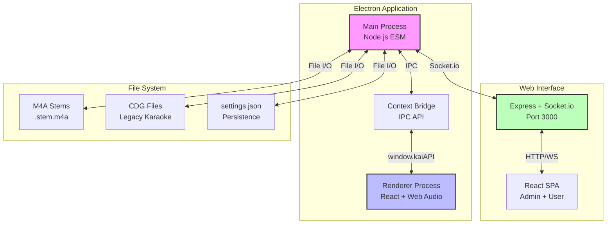
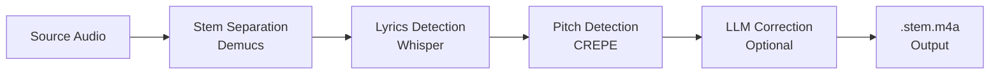
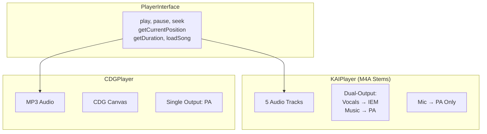
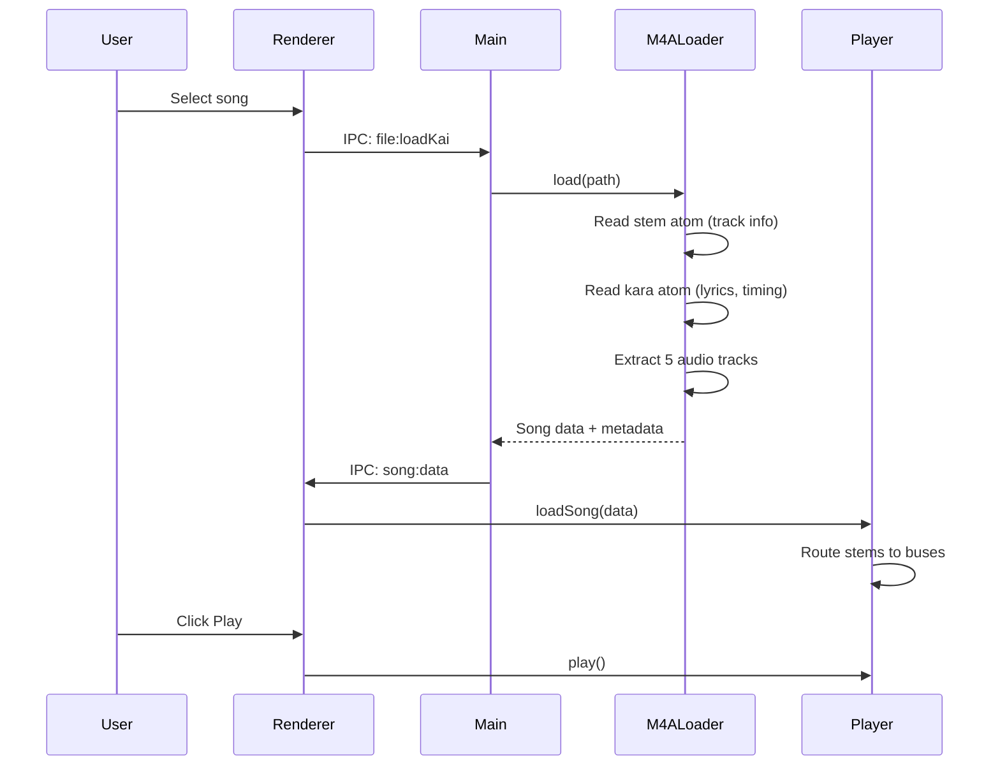
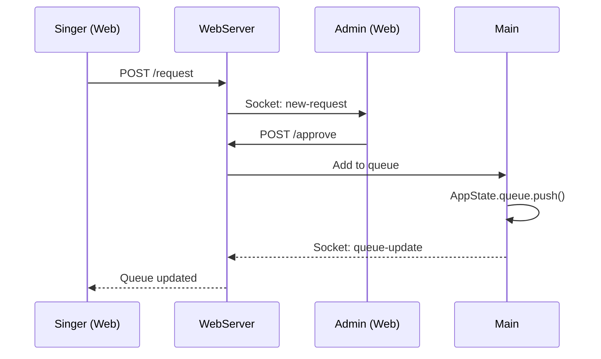

# Loukai Architecture

## Overview

Loukai is a professional karaoke system that uses AI stem separation and dual-output audio routing to provide coaching capabilities. The system separates vocals from backing music and routes them to different audio devices - vocals to in-ear monitors (IEM) for the singer, music to PA speakers for the audience.

**Key Design Decision:** Loukai uses an open file format (`.stem.m4a`) that serves dual purposes:
- **DJ Software**: Files work in Traktor and Mixxx via standard NI Stems metadata
- **Karaoke**: Additional atoms provide lyrics, pitch tracking, and multi-singer support

This means the same files can be used for both DJing and karaoke without conversion.

## System Architecture



## Directory Structure

```
src/
├── main/                    # Electron main process
│   ├── main.js             # Application entry, IPC handlers (~77KB)
│   ├── webServer.js        # Express + Socket.io server (~75KB)
│   ├── appState.js         # EventEmitter-based state
│   ├── audioEngine.js      # Main process audio coordination
│   ├── settingsManager.js  # JSON settings persistence
│   ├── statePersistence.js # Auto-save state changes
│   ├── preload.js          # Context bridge API
│   ├── handlers/           # IPC handler modules
│   └── creator/            # Song creation pipeline
│       ├── conversionService.js
│       ├── downloadManager.js
│       ├── ffmpegService.js
│       ├── keyDetection.js
│       ├── llmService.js
│       ├── lrclibService.js
│       ├── pythonRunner.js
│       ├── stemBuilder.js
│       └── systemChecker.js
├── renderer/               # Electron renderer (React)
│   ├── components/         # Renderer-specific components
│   ├── js/                 # Audio engine (vanilla JS)
│   │   ├── kaiPlayer.js
│   │   ├── cdgPlayer.js
│   │   ├── karaokeRenderer.js
│   │   ├── microphoneEngine.js
│   │   └── worklets/
│   └── styles/
├── shared/                 # Shared across all contexts
│   ├── components/         # Shared React components
│   ├── services/           # Business logic services
│   ├── adapters/           # Bridge pattern implementations
│   ├── hooks/              # React hooks
│   ├── contexts/           # React contexts
│   ├── state/              # State utilities
│   └── utils/              # Pure utility functions
├── web/                    # Web admin interface (React)
│   ├── App.jsx
│   ├── pages/
│   ├── components/
│   └── adapters/
└── utils/                  # File loaders
    ├── m4aLoader.js
    └── cdgLoader.js
```

## Core Components

### 1. Main Process (Electron/Node.js)

The orchestrator that coordinates all application functionality.

**Key Files:**
- `main.js` - Application controller, IPC handlers
- `webServer.js` - Express + Socket.io server
- `appState.js` - EventEmitter-based canonical state
- `settingsManager.js` - JSON file persistence

**Key Responsibilities:**
- Window management (main window, canvas window for visualizations)
- File loading and parsing (M4A stems, CDG archives)
- Settings persistence and state management
- IPC handler orchestration (100+ channels)
- WebSocket broadcasting to web clients
- Library scanning and song catalog management
- Song queue management

### 2. Renderer Process (React + Web Audio API)

React-based UI with real-time audio processing.

**Architecture:**
```
AppRoot (Context Providers)
├── PlayerContext
├── AudioContext
├── SettingsContext
└── App Component
    ├── TabNavigation
    ├── MixerTab
    ├── QueueTab
    ├── ServerTab
    └── CreatorTab
```

**Audio Engine (Vanilla JS):**
- `kaiPlayer.js` - M4A stems playback with dual-output routing
- `cdgPlayer.js` - Legacy CDG format playback
- `karaokeRenderer.js` - Canvas rendering + Butterchurn effects
- `microphoneEngine.js` - Microphone input with auto-tune

### 3. Web Interface

Two distinct React SPAs served by the Express server:

**User/Singer UI** (`/user`):
- Browse song library with search
- Request songs from catalog
- View current queue

**Admin UI** (`/admin`):
- Full mixer control
- Playback control
- Approve/reject requests
- Queue management
- Server settings
- Song editor

### 4. Creator Pipeline

Song creation system for converting regular audio to karaoke format:



**Components:**
- `systemChecker.js` - Verifies Python, FFmpeg, ML models
- `downloadManager.js` - Downloads FFmpeg, Python packages
- `conversionService.js` - Orchestrates conversion pipeline
- `stemBuilder.js` - Creates .stem.m4a with NI Stems + karaoke atoms
- `llmService.js` - AI-powered lyrics correction
- `lrclibService.js` - External lyrics lookup
- `keyDetection.js` - Musical key detection

**Output File Structure:**
The stemBuilder creates files with dual metadata for maximum compatibility:
1. **NI Stems metadata** (`stem` atom) - For DJ software (Traktor, Mixxx)
2. **Karaoke atom** (`kara`) - For lyrics and word timing

## Shared Services Layer

Business logic shared between IPC handlers and REST endpoints:

| Service | Purpose |
|---------|---------|
| `playerService.js` | Playback control (play, pause, seek, next) |
| `queueService.js` | Queue management (add, remove, reorder) |
| `libraryService.js` | Song catalog, search, scanning |
| `mixerService.js` | Mixer state (gain, mute per bus) |
| `effectsService.js` | Visual effects management |
| `settingsService.js` | Settings CRUD |
| `editorService.js` | Song editing (metadata, lyrics) |
| `creatorService.js` | Song creation pipeline |
| `requestsService.js` | Song request approval |
| `serverSettingsService.js` | Web server settings |
| `preferencesService.js` | User preferences |

**Pattern:**
```javascript
// Service provides pure business logic
export function addSongToQueue(appState, queueItem) {
  const queue = appState.getQueue();
  queue.push(queueItem);
  appState.setQueue(queue);
  return { success: true, queue };
}

// IPC handler is thin wrapper
ipcMain.handle('queue:addSong', (event, item) => {
  return addSongToQueue(this.appState, item);
});

// REST endpoint uses same service
app.post('/queue/add', (req, res) => {
  res.json(addSongToQueue(this.appState, req.body));
});
```

## File Formats

### M4A Stems Format (Primary)

Industry-standard MP4 container built on [NI Stems](https://www.native-instruments.com/en/specials/stems/) with karaoke extensions. Files contain **dual metadata** for maximum compatibility:

1. **NI Stems metadata** - For DJ software (Traktor, Mixxx)
2. **Karaoke atoms** - For lyrics, pitch tracking, word timing

**Structure:**
```
song.stem.m4a
├── Audio Tracks (AAC)
│   ├── Track 0: master (enabled - plays in normal players)
│   ├── Track 1: drums (disabled)
│   ├── Track 2: bass (disabled)
│   ├── Track 3: other (disabled)
│   └── Track 4: vocals (disabled)
├── moov/udta/
│   ├── stem (NI Stems metadata - JSON)
│   └── meta/ilst/
│       ├── ©nam, ©ART, etc. (standard metadata)
│       └── ----:com.stems:kara (karaoke data with word timing - JSON)
└── mdat (compressed audio data)
```

**NI Stems Atom** (`moov/udta/stem`) - Required for Mixxx/Traktor:
```json
{
  "version": 1,
  "mastering_dsp": {
    "compressor": { "enabled": true, "threshold": -6.0, "ratio": 2.0, ... },
    "limiter": { "enabled": true, "ceiling": -0.3, ... }
  },
  "stems": [
    { "name": "drums", "color": "#FF0000" },
    { "name": "bass", "color": "#00FF00" },
    { "name": "other", "color": "#0000FF" },
    { "name": "vocals", "color": "#FFFF00" }
  ]
}
```

**Kara Atom** (`moov/udta/meta/ilst/----:com.stems:kara`) - Karaoke data:
```json
{
  "timing": { "offset_sec": 0, "encoder_delay_samples": 0 },
  "lines": [
    { "start": 10.5, "end": 15.2, "text": "Hello world" },
    { "start": 15.8, "end": 18.1, "text": "Backup line", "singer": "backup:PA" }
  ],
  "singers": {
    "A": { "name": "Lead" },
    "B": { "name": "Duet Partner" }
  },
  "tags": ["edited", "ai_corrected"],
  "meta": {
    "corrections": { "applied": [...], "rejected": [...] }
  }
}
```

**Note:** Audio track information (sources, track mapping) is read from the NI Stems `stem` atom, not the kara atom. This avoids duplication since both DJ software and Loukai need the same track info.

See [m4a_format.md](m4a_format.md) for complete format specification.

### CDG Format (Legacy Support)

Traditional karaoke format with MP3 audio and graphics.

**Supported formats:**
- Loose pair: `song.mp3` + `song.cdg`
- Archive: `song.zip` or `song.kar` containing audio + CDG

## Player Architecture

Unified interface for multiple karaoke formats:



**Dual-Output Routing (M4A Stems):**
- **Vocals** → Individual Gain → **IEM Bus** → Headphones
- **Music/Bass/Drums** → Individual Gain → **PA Bus** → Speakers
- **Microphone** → Mic Gain → Auto-tune → **PA Bus ONLY**

## Song Editor

The SongEditor component provides metadata and lyrics editing:

**Features:**
- Edit title, artist, album, year, genre, key
- Edit lyrics with visual timeline
- Multi-singer support with per-line singer assignment (`singer: "backup:PA"` for punchthrough)
- Review AI corrections (applied/rejected)
- Review suggested missing lines
- Accept/reject suggestions
- Tag management (`edited`, `ai_corrected`, custom tags)

**Corrections Flow:**
```
Creator generates corrections (LLM)
    ↓
Saved in kara.meta.corrections.applied
    ↓
Editor shows for review
    ↓
User can reject → moves to kara.meta.corrections.rejected
    ↓
Save writes updated kara atom to file
```

**What Gets Saved:**
- Standard metadata (title, artist, etc.) → MP4 atoms (©nam, ©ART, etc.)
- Lyrics, timing, singers, tags → `kara` atom
- NI Stems metadata is preserved (not modified by editor)

## Auto-Tune System

Real-time pitch correction using AudioWorklet:

**Components:**
- `autoTuneWorklet.js` - Low-latency audio processing
- `micPitchDetectorWorklet.js` - Pitch detection
- `phaseVocoderWorklet.js` - Pitch shifting (future)

**Parameters:**
| Parameter | Range | Default | Description |
|-----------|-------|---------|-------------|
| Enabled | on/off | off | Master enable |
| Strength | 0-100% | 50% | Effect intensity |
| Speed | 1-100ms | 5ms | Correction speed |
| Key | C-B | C | Musical key |

## IPC Communication

Channels organized by domain:

| Prefix | Purpose |
|--------|---------|
| `app:*` | App metadata |
| `file:*` | File operations |
| `audio:*` | Device selection |
| `mixer:*` | Gain/mute control |
| `player:*` | Playback control |
| `autotune:*` | Auto-tune settings |
| `song:*` | Song data events |
| `editor:*` | Song editing |
| `library:*` | Library scanning |
| `queue:*` | Queue management |
| `webServer:*` | Server settings |
| `creator:*` | Song creation |
| `effect:*` | Visual effects |
| `canvas:*` | WebRTC streaming |

## Technology Stack

### Main Process
- **Electron 38** - Desktop framework
- **Express 5** - Web server
- **Socket.io 4** - Real-time communication
- **m4a-stems** - NI Stems + karaoke atom reading/writing
- **music-metadata** - Audio metadata parsing
- **yauzl/yazl** - ZIP handling
- **Fuse.js 7** - Fuzzy search

### Renderer Process
- **React 19** - UI framework
- **Vite 7** - Build tool
- **Web Audio API** - Audio processing
- **Butterchurn 2** - Visualizations
- **Canvas API** - Graphics rendering

### AI/ML (Creator)
- **Demucs** - Stem separation (Python)
- **Whisper** - Speech-to-text (Python)
- **CREPE** - Pitch detection (Python)
- **OpenAI/Anthropic/Google** - LLM lyrics correction

### Build & Distribution
- **electron-builder 26** - Packaging
- **GitHub Actions** - CI/CD
- **Targets:** AppImage, Flatpak (Linux), NSIS (Windows), DMG (macOS)

## Bridge Pattern

Abstracts transport layer for shared components:

```javascript
// BridgeInterface defines API
interface BridgeInterface {
  play(): Promise<void>
  searchSongs(query: string): Promise<{songs: Array}>
  addToQueue(item: QueueItem): Promise<void>
  // ...
}

// ElectronBridge uses IPC
class ElectronBridge {
  async play() {
    return await window.kaiAPI.player.play();
  }
}

// WebBridge uses HTTP/Socket.io
class WebBridge {
  async play() {
    await this._fetch('/playback/play', { method: 'POST' });
  }
}

// Components are transport-agnostic
function LibraryPanel({ bridge }) {
  const handleSearch = async (query) => {
    const result = await bridge.searchSongs(query);
    // Works with both bridges!
  };
}
```

## Data Flow Examples

### Loading and Playing a Song



Note: The NI `stem` atom provides audio track info for both DJ software and Loukai. The `kara` atom only contains karaoke-specific data (lyrics, timing, singers).

### Song Request Flow



## Performance Considerations

### Audio Engine
- Dual AudioContext for IEM/PA separation
- Pre-decoded AudioBuffers
- AudioWorklet for low-latency processing

### Library
- In-memory Fuse.js index for search
- Cached metadata to avoid re-scanning
- Incremental sync for file changes

### Web Server
- Socket.io for efficient real-time updates
- Debounced state broadcasts

## Security

### Web Server
- bcryptjs password hashing
- Session-based authentication
- Role-based access (user vs admin)
- Rate limiting

### Electron
- Context bridge API (no direct Node access in renderer)
- Sandboxed web content
