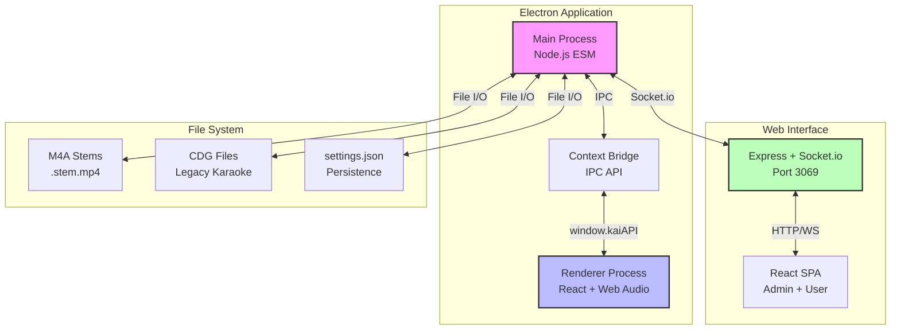
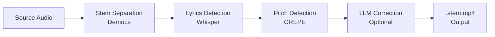
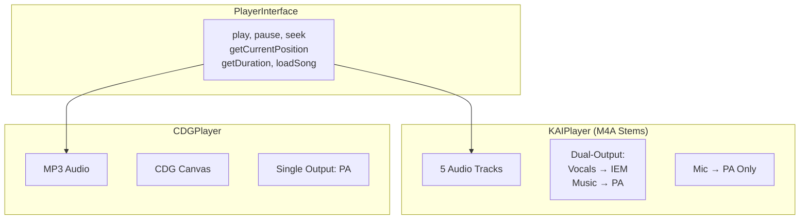
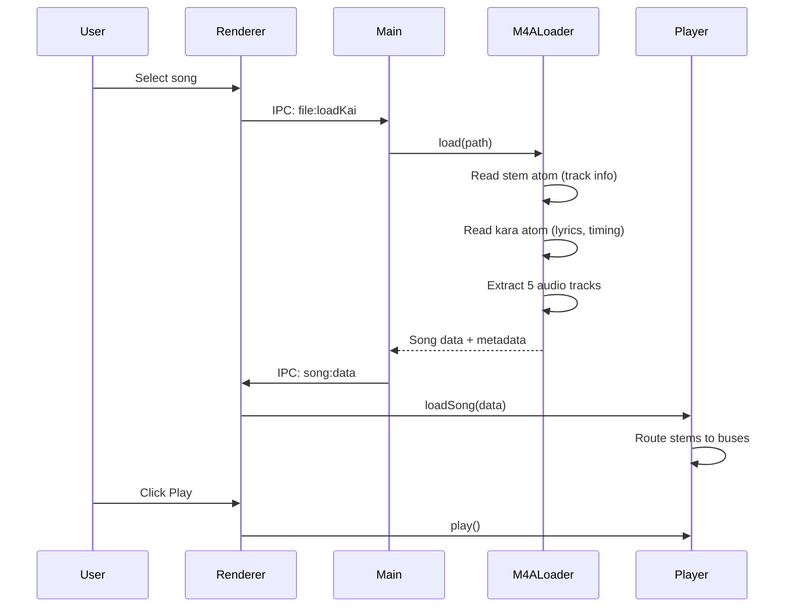
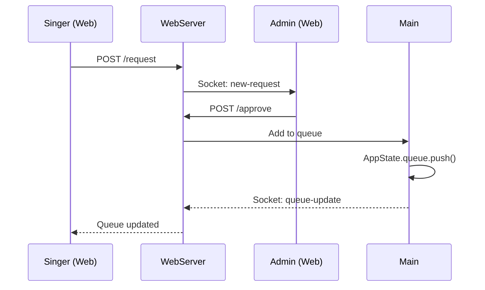

# Loukai Architecture

## Overview

Loukai is a professional karaoke system built on AI stem separation and dual-output audio routing. The system separates vocals from backing music and routes them to different audio devices - the recorded guide vocals to in-ear monitors (IEM) for the singer, music to PA speakers for the audience, and the live microphone (with optional auto-tune) to the PA.

**Key Design Decision:** Loukai uses an open file format (`.stem.mp4`) that serves dual purposes:
- **DJ Software**: Files work in Traktor and Mixxx via standard NI Stems metadata
- **Karaoke**: Additional atoms provide lyrics, pitch tracking, and multi-singer support

This means the same files can be used for both DJing and karaoke without conversion.

## System Architecture


```mermaid
graph TB
    subgraph "Electron Application"
        Main[Main Process<br/>Node.js ESM]
        Renderer[Renderer Process<br/>React + Web Audio]
        Preload[Context Bridge<br/>IPC API]
    end

    subgraph "Web Interface"
        WebServer[Express + Socket.io<br/>Port 3069]
        WebUI[React SPA<br/>Admin + User]
    end

    subgraph "File System"
        M4A[M4A Stems<br/>.stem.mp4]
        CDG[CDG Files<br/>Legacy Karaoke]
        Settings[settings.json<br/>Persistence]
    end

    Main <-->|IPC| Preload
    Preload <-->|window.kaiAPI| Renderer
    Main <-->|Socket.io| WebServer
    WebServer <-->|HTTP/WS| WebUI
    Main <-->|File I/O| M4A
    Main <-->|File I/O| CDG
    Main <-->|File I/O| Settings

    style Main fill:#f9f,stroke:#333,stroke-width:2px
    style Renderer fill:#bbf,stroke:#333,stroke-width:2px
    style WebServer fill:#bfb,stroke:#333,stroke-width:2px
```

## Directory Structure

```
src/
├── main/                    # Electron main process
│   ├── main.js             # Application entry, IPC handlers (~77KB)
│   ├── webServer.js        # Express + Socket.io server (~75KB)
│   ├── appState.js         # EventEmitter-based state
│   ├── audioEngine.js      # Legacy state stub (NO audio I/O — all audio is renderer Web Audio)
│   ├── settingsManager.js  # JSON settings persistence
│   ├── statePersistence.js # Auto-save state changes
│   ├── preload.js          # Context bridge API
│   ├── handlers/           # IPC handler modules
│   └── creator/            # Song creation (main-process side)
│       ├── audioInfo.js        # Pure-JS audio inspection
│       ├── creatorJob.js       # Single observable job status (IPC + web)
│       ├── hostCreateRelay.js  # main↔renderer protocol for host-create jobs
│       ├── keyDetection.js
│       ├── llmService.js
│       ├── lrclibService.js
│       ├── stemBuilder.js
│       ├── systemChecker.js    # Cache-directory helper
│       └── webgpuAssets.js     # Same-origin caching proxy for JS/wasm/ONNX assets
├── renderer/               # Electron renderer (React)
│   ├── components/         # Renderer-specific components
│   ├── js/                 # Audio engine (vanilla JS)
│   │   ├── kaiPlayer.js            # Stem playback + PA/IEM routing
│   │   ├── cdgPlayer.js
│   │   ├── karaokeRenderer.js
│   │   ├── microphoneEngine.js     # Mic capture + auto-tune chain
│   │   ├── micPitchDetectorWorklet.js   # (worklets live directly in js/)
│   │   ├── phaseVocoderWorklet.js       # Production pitch shifter
│   │   └── musicAnalysisWorklet.js      # Reference pitch for auto-tune
│   └── styles/
├── shared/                 # Shared across all contexts
│   ├── components/         # Shared React components
│   ├── creator/            # In-browser WebGPU creation pipeline (Demucs/Whisper/CREPE/AAC)
│   ├── services/           # Business logic services
│   ├── adapters/           # Bridge pattern implementations
│   ├── hooks/              # React hooks
│   ├── contexts/           # React contexts
│   ├── state/              # State utilities
│   └── utils/              # Pure utility functions
├── web/                    # Web admin interface (React)
│   ├── App.jsx
│   ├── pages/
│   ├── components/
│   └── adapters/
├── offsite/                # Standalone offsite creator page
└── utils/                  # File loaders
    ├── m4aLoader.js
    └── cdgLoader.js
```

## Core Components

### 1. Main Process (Electron/Node.js)

The orchestrator that coordinates all application functionality.

**Key Files:**
- `main.js` - Application controller, IPC handlers
- `webServer.js` - Express + Socket.io server
- `appState.js` - EventEmitter-based canonical state
- `settingsManager.js` - JSON file persistence

**Key Responsibilities:**
- Window management (main window, canvas window for visualizations)
- File loading and parsing (M4A stems, CDG archives)
- Settings persistence and state management
- IPC handler orchestration (100+ channels)
- WebSocket broadcasting to web clients
- Library scanning and song catalog management
- Song queue management

### 2. Renderer Process (React + Web Audio API)

React-based UI with real-time audio processing.

**Architecture:**
```
AppRoot (Context Providers)
├── PlayerContext
├── AudioContext
├── SettingsContext
└── App Component
    ├── TabNavigation
    ├── MixerTab
    ├── QueueTab
    ├── ServerTab
    └── CreatorTab
```

**Audio Engine (Vanilla JS):**
- `kaiPlayer.js` - M4A stems playback with dual-output routing
- `cdgPlayer.js` - Legacy CDG format playback
- `karaokeRenderer.js` - Canvas rendering + Butterchurn effects
- `microphoneEngine.js` - Microphone input with auto-tune

### 3. Web Interface

Two distinct React SPAs served by the Express server:

**User/Singer UI** (`/user`):
- Browse song library with search
- Request songs from catalog
- View current queue

**Admin UI** (`/admin`):
- Full mixer control
- Playback control
- Approve/reject requests
- Queue management
- Server settings
- Song editor

### 4. Creator Pipeline

Song creation runs **entirely in-browser** (renderer or web page) on WebGPU via onnxruntime-web, with WASM fallback — no Python, native modules, or system ffmpeg. Main-process code only proxies/caches assets, tracks job status, and muxes/saves output. A web-admin "host-create" path lets a phone upload audio to `POST /admin/creator/host-create`; the desktop player's renderer then runs the GPU creation (see `hostCreateRelay.js`).


```mermaid
graph LR
    Audio[Source Audio] --> Stems[Stem Separation<br/>Demucs]
    Stems --> Lyrics[Lyrics Detection<br/>Whisper]
    Lyrics --> Pitch[Pitch Detection<br/>CREPE]
    Pitch --> LLM[LLM Correction<br/>Optional]
    LLM --> M4A[.stem.mp4<br/>Output]
```

**Components:**
- `src/shared/creator/createKaraoke.js` (+ `.worker.js`) - Orchestrates the in-browser pipeline
- `webgpuAssets.js` - Same-origin asset server (`/webgpu-assets`): serves the vendored libs (onnxruntime-web, transformers.js, @ffmpeg/core wasm — bundled into static/webgpu at build time by `scripts/vendor-webgpu-assets.js`) and proxies+caches the ONNX models from Hugging Face on first use, then serves everything offline
- `creatorJob.js` - Single observable job descriptor shared by the Electron tab and web admins
- `systemChecker.js` - Cache-directory helper (`getCacheDir`)
- `stemBuilder.js` - Creates .stem.mp4 with NI Stems + karaoke atoms
- `llmService.js` - AI-powered lyrics correction
- `lrclibService.js` - External lyrics lookup
- `keyDetection.js` - Musical key detection

**Output File Structure:**
The stemBuilder creates files with dual metadata for maximum compatibility:
1. **NI Stems metadata** (`stem` atom) - For DJ software (Traktor, Mixxx)
2. **Karaoke atom** (`kara`) - For lyrics and word timing

## Shared Services Layer

Business logic shared between IPC handlers and REST endpoints:

| Service | Purpose |
|---------|---------|
| `playerService.js` | Playback control (play, pause, seek, next) |
| `queueService.js` | Queue management (add, remove, reorder) |
| `libraryService.js` | Song catalog, search, scanning |
| `mixerService.js` | Mixer state (gain, mute per bus) |
| `effectsService.js` | Visual effects management |
| `settingsService.js` | Settings CRUD |
| `editorService.js` | Song editing (metadata, lyrics) |
| `creatorService.js` | Song creation pipeline |
| `requestsService.js` | Song request approval |
| `serverSettingsService.js` | Web server settings |
| `preferencesService.js` | User preferences |

**Pattern:**
```javascript
// Service provides pure business logic
export function addSongToQueue(appState, queueItem) {
  const queue = appState.getQueue();
  queue.push(queueItem);
  appState.setQueue(queue);
  return { success: true, queue };
}

// IPC handler is thin wrapper
ipcMain.handle('queue:addSong', (event, item) => {
  return addSongToQueue(this.appState, item);
});

// REST endpoint uses same service
app.post('/queue/add', (req, res) => {
  res.json(addSongToQueue(this.appState, req.body));
});
```

## File Formats

### M4A Stems Format (Primary)

Industry-standard MP4 container built on [NI Stems](https://www.native-instruments.com/en/specials/stems/) with karaoke extensions. Files contain **dual metadata** for maximum compatibility:

1. **NI Stems metadata** - For DJ software (Traktor, Mixxx)
2. **Karaoke atoms** - For lyrics, pitch tracking, word timing

**Structure:**
```
song.stem.mp4
├── Audio Tracks (AAC)
│   ├── Track 0: master (enabled - plays in normal players)
│   ├── Track 1: drums (disabled)
│   ├── Track 2: bass (disabled)
│   ├── Track 3: other (disabled)
│   └── Track 4: vocals (disabled)
├── moov/udta/
│   ├── stem (NI Stems metadata - JSON)
│   └── meta/ilst/
│       ├── ©nam, ©ART, etc. (standard metadata)
│       └── ----:com.stems:kara (karaoke data with word timing - JSON)
└── mdat (compressed audio data)
```

**NI Stems Atom** (`moov/udta/stem`) - Required for Mixxx/Traktor:
```json
{
  "version": 1,
  "mastering_dsp": {
    "compressor": { "enabled": true, "threshold": -6.0, "ratio": 2.0, ... },
    "limiter": { "enabled": true, "ceiling": -0.3, ... }
  },
  "stems": [
    { "name": "drums", "color": "#FF0000" },
    { "name": "bass", "color": "#00FF00" },
    { "name": "other", "color": "#0000FF" },
    { "name": "vocals", "color": "#FFFF00" }
  ]
}
```

**Kara Atom** (`moov/udta/meta/ilst/----:com.stems:kara`) - Karaoke data:
```json
{
  "timing": { "offset_sec": 0, "encoder_delay_samples": 0 },
  "lines": [
    { "start": 10.5, "end": 15.2, "text": "Hello world" },
    { "start": 15.8, "end": 18.1, "text": "Backup line", "singer": "backup:PA" }
  ],
  "singers": {
    "A": { "name": "Lead" },
    "B": { "name": "Duet Partner" }
  },
  "tags": ["edited", "ai_corrected"],
  "meta": {
    "corrections": { "applied": [...], "rejected": [...] }
  }
}
```

**Note:** Audio track information (sources, track mapping) is read from the NI Stems `stem` atom, not the kara atom. This avoids duplication since both DJ software and Loukai need the same track info.

See [m4a_format.md](m4a_format.md) for complete format specification.

### CDG Format (Legacy Support)

Traditional karaoke format with MP3 audio and graphics.

**Supported formats:**
- Loose pair: `song.mp3` + `song.cdg`
- Archive: `song.zip` or `song.kar` containing audio + CDG

## Player Architecture

Unified interface for multiple karaoke formats:


```mermaid
graph TB
    subgraph "PlayerInterface"
        Methods[play, pause, seek<br/>getCurrentPosition<br/>getDuration, loadSong]
    end

    subgraph "KAIPlayer (M4A Stems)"
        KAISources[5 Audio Tracks]
        KAIRouting[Dual-Output:<br/>Vocals → IEM<br/>Music → PA]
        KAIMic[Mic → PA Only]
    end

    subgraph "CDGPlayer"
        CDGAudio[MP3 Audio]
        CDGGraphics[CDG Canvas]
        CDGPA[Single Output: PA]
    end

    Methods --> KAISources
    Methods --> CDGAudio
```

## Audio Engine & Routing (Web Audio)

All audible audio lives in the **renderer** as Web Audio. The main-process
`audioEngine.js` is a legacy state stub with no audio I/O.

### Two AudioContexts, one per output device

`KAIPlayer` creates **two independent `AudioContext`s** — PA and IEM — each bound
to its physical output device via the `AudioContext({ sinkId })` constructor
option (not `setSinkId()` on media elements). Changing an output device closes
and rebuilds that entire context (and, for PA, the microphone engine and its
worklets).

```
PA context (sinkId: PA device)                 IEM context (sinkId: IEM device)
──────────────────────────────                 ────────────────────────────────
EVERY stem ─► per-stem gain (PA) ─────────┐    EVERY stem ─► per-stem gain (IEM)
mic ─► micGain ─► [auto-tune chain] ──────┤        └─(iemMonoVocals?)─► ChannelMerger(1)
                                          ▼                              │
                                    PA.masterGain                        ▼
                                     ├─► destination (PA device)   IEM.masterGain
                                     └─► streamDestination           └─► destination (IEM device)
                                          (MediaStream → WebRTC viewers)
       (per-source pre-gain tap ─► AnalyserNode ─► Butterchurn)
```

### Routing rules (stem×bus mixer, #49)

- **Every stem plays into BOTH contexts, always** (dual always-running sources).
  Audibility is decided per `(bus, stem)` by a gain formula, not by topology:
  `effective = trim(dB from song metadata) × userGain(0..1.5) × mute`. Mixer
  changes are glitch-free gain ramps; no source rebuilds.
- **Defaults**: PA plays music with vocals muted (karaoke); **IEM starts fully
  muted** — a second sound card can't be assumed, so monitors are an explicit
  opt-in per stem. Stems are classified by name keywords (`isVocalStem`:
  vocals/vocal/voice/lead/singing/vox) for the defaults and for punchthrough.
- **`backup:PA` punchthrough**: lyric lines tagged `singer: "backup:PA"` ramp
  the PA vocal stem over 50 ms to `max(userGain, authored)` — an authored
  punchthrough can't be silenced by a user mute, and a user boost survives it.
- **The live mic goes to PA only** and lives in the PA context (nodes cannot
  span `AudioContext`s). IEM mono ("single earpiece" mode) sums through a
  `ChannelMerger(1)`; toggling it rebuilds sources.
- `AudioBuffer`s are decoded once (PA context) and shared — buffers are
  context-agnostic.
- Mixer model: three master faders (PA / IEM / mic) plus per-stem gain/mute on
  each bus, persisted wholesale as `appState.mixer.stemMix` and controlled from
  the Audio tab, the PA quick-mix drawer, and `POST /admin/mixer/stem`.
- CDG songs collapse to a single "music" node per bus (`songType` rides the
  mixer broadcast so remote UIs render the simplified variant).

### Clocks and scheduling

- Within one context, stems are sample-locked: every source is scheduled at that
  context's own `currentTime + 0.1`.
- **PA and IEM are separate hardware clocks** — start instants are aligned, but
  the two devices drift freely over a long song (no resync exists).
- Playback position truth is the PA clock. Pause/seek/resume rebuild all source
  nodes (sources are throwaway; gain topology persists per `createAudioGraph()`).

### Microphone chain

Captured with `getUserMedia` (mono, echoCancellation/noiseSuppression/
autoGainControl all **disabled**), in the PA context:

```
micSource ─► microphoneGain ─► [auto-tune off: straight to PA.masterGain]
                          └──► [auto-tune on:]
                               mic-pitch-detector (pass-through + pitch messages)
                               ─► phase-vocoder-processor (pitchSemitones, FFT 2048/hop 512)
                               ─► makeup gain (1.2x) ─► DynamicsCompressor (-24 dB, 3:1)
                               ─► PA.masterGain
```

There are currently **no reverb/echo/delay effects** in the audible chain
(`effectsService` is Butterchurn visual presets, not vocal effects).

### Taps

- **Butterchurn** reads a PA `AnalyserNode` fed per-source *pre-gain* (hears full
  level even when PA is muted; does not hear vocals or mic).
- **Web streaming** reads `PA.streamDestination` (post-masterGain, so viewers hear
  the full PA mix including mic/auto-tune; PA mute silences the stream).
- CDG playback uses the same PA context/masterGain (single-bus), so legacy songs
  inherit PA device selection, mute, and streaming automatically.

## Song Editor

The SongEditor component provides metadata and lyrics editing:

**Features:**
- Edit title, artist, album, year, genre, key
- Edit lyrics with visual timeline
- Multi-singer support with per-line singer assignment (`singer: "backup:PA"` for punchthrough)
- Review AI corrections (applied/rejected)
- Review suggested missing lines
- Accept/reject suggestions
- Tag management (`edited`, `ai_corrected`, custom tags)

**Corrections Flow:**
```
Creator generates corrections (LLM)
    ↓
Saved in kara.meta.corrections.applied
    ↓
Editor shows for review
    ↓
User can reject → moves to kara.meta.corrections.rejected
    ↓
Save writes updated kara atom to file
```

**What Gets Saved:**
- Standard metadata (title, artist, etc.) → MP4 atoms (©nam, ©ART, etc.)
- Lyrics, timing, singers, tags → `kara` atom
- NI Stems metadata is preserved (not modified by editor)

## Auto-Tune System

Real-time pitch correction toward the **recorded guide-vocal stem's pitch**
(not a musical key/scale). Three AudioWorklets, all in the mic → PA chain:

**Components:**
- `micPitchDetectorWorklet.js` - Autocorrelation pitch detection (80-800 Hz,
  2048-sample buffer), audio passes through unchanged
- `phaseVocoderWorklet.js` - The production pitch shifter (FFT 2048 / hop 512,
  Hann window, formant preservation; ~43 ms inherent algorithmic latency)
- `musicAnalysisWorklet.js` - Detects the reference pitch from the vocal +
  melodic stem sources (via `ReferencePitchTracker`)

A 20 Hz main-thread loop compares detected mic pitch to the reference, computes
a semitone offset (octave-folded to ±12, clamped ±24), scales by strength,
smooths by speed, and writes the phase vocoder's `pitchSemitones` AudioParam.

**Parameters:**
| Parameter | Range | Default | Description |
|-----------|-------|---------|-------------|
| Enabled | on/off | off | Master enable |
| Strength | 0-100% | 50% | Fraction of the computed correction applied |
| Speed | 1-100 | 20 | Smoothing factor (low = natural glide, high = hard snap) |

There is no key/scale parameter — the target comes from the song itself.
(`autoTuneWorklet.js` and `soundtouch-worklet.js` are unused legacy files; the
phase vocoder is the live path.)

## IPC Communication

Channels organized by domain:

| Prefix | Purpose |
|--------|---------|
| `app:*` | App metadata |
| `file:*` | File operations |
| `audio:*` | Device selection |
| `mixer:*` | Gain/mute control |
| `player:*` | Playback control |
| `autotune:*` | Auto-tune settings |
| `song:*` | Song data events |
| `editor:*` | Song editing |
| `library:*` | Library scanning |
| `queue:*` | Queue management |
| `webServer:*` | Server settings |
| `creator:*` | Song creation |
| `effect:*` | Visual effects |
| `canvas:*` | WebRTC streaming |

## Technology Stack

### Main Process
- **Electron 42** - Desktop framework
- **Express 5** - Web server
- **Socket.io 4** - Real-time communication
- **stem-mp4** - NI Stems + karaoke atom reading/writing
- **music-metadata** - Audio metadata parsing
- **yauzl/yazl** - ZIP handling
- **Fuse.js 7** - Fuzzy search

### Renderer Process
- **React 19** - UI framework
- **Vite 7** - Build tool
- **Web Audio API** - Audio processing
- **Butterchurn 2** - Visualizations
- **Canvas API** - Graphics rendering

### AI/ML (Creator) — 100% in-browser, WebGPU with WASM fallback
- **Demucs** - Stem separation (htdemucs ONNX via onnxruntime-web; optional htdemucs_ft ensemble)
- **Whisper** - Speech-to-text (@huggingface/transformers, timestamped ONNX models)
- **CREPE** - Pitch/key detection (crepe_tiny.onnx bundled in static/webgpu)
- **AAC encode** - ffmpeg-wasm (@ffmpeg/core single-thread, in a web worker)
- **aubiojs** - Realtime pitch tracking
- **OpenAI/Anthropic/Google** - LLM lyrics correction

### Build & Distribution
- **electron-builder 26** - Packaging
- **GitHub Actions** - CI/CD
- **Targets:** AppImage, Flatpak (Linux), NSIS (Windows), DMG (macOS)

## Bridge Pattern

Abstracts transport layer for shared components:

```javascript
// BridgeInterface defines API
interface BridgeInterface {
  play(): Promise<void>
  searchSongs(query: string): Promise<{songs: Array}>
  addToQueue(item: QueueItem): Promise<void>
  // ...
}

// ElectronBridge uses IPC
class ElectronBridge {
  async play() {
    return await window.kaiAPI.player.play();
  }
}

// WebBridge uses HTTP/Socket.io
class WebBridge {
  async play() {
    await this._fetch('/playback/play', { method: 'POST' });
  }
}

// Components are transport-agnostic
function LibraryPanel({ bridge }) {
  const handleSearch = async (query) => {
    const result = await bridge.searchSongs(query);
    // Works with both bridges!
  };
}
```

## Data Flow Examples

### Loading and Playing a Song


```mermaid
sequenceDiagram
    participant User
    participant Renderer
    participant Main
    participant M4ALoader
    participant Player

    User->>Renderer: Select song
    Renderer->>Main: IPC: file:loadKai
    Main->>M4ALoader: load(path)
    M4ALoader->>M4ALoader: Read stem atom (track info)
    M4ALoader->>M4ALoader: Read kara atom (lyrics, timing)
    M4ALoader->>M4ALoader: Extract 5 audio tracks
    M4ALoader-->>Main: Song data + metadata
    Main->>Renderer: IPC: song:data
    Renderer->>Player: loadSong(data)
    Player->>Player: Route stems to buses
    User->>Renderer: Click Play
    Renderer->>Player: play()
```

Note: The NI `stem` atom provides audio track info for both DJ software and Loukai. The `kara` atom only contains karaoke-specific data (lyrics, timing, singers).

### Song Request Flow


```mermaid
sequenceDiagram
    participant Singer as Singer (Web)
    participant WebServer
    participant Admin as Admin (Web)
    participant Main

    Singer->>WebServer: POST /request
    WebServer->>Admin: Socket: new-request
    Admin->>WebServer: POST /approve
    WebServer->>Main: Add to queue
    Main->>Main: AppState.queue.push()
    Main-->>WebServer: Socket: queue-update
    WebServer-->>Singer: Queue updated
```

## Performance Considerations

### Audio Engine
- Dual AudioContext for IEM/PA separation
- Pre-decoded AudioBuffers
- AudioWorklet for low-latency processing

### Library
- In-memory Fuse.js index for search
- Cached metadata to avoid re-scanning
- Incremental sync for file changes

### Web Server
- Socket.io for efficient real-time updates
- Debounced state broadcasts

## Security

### Web Server
- bcryptjs password hashing
- Session-based authentication
- Role-based access (user vs admin)
- Rate limiting

### Electron
- Context bridge API (no direct Node access in renderer)
- Sandboxed web content
