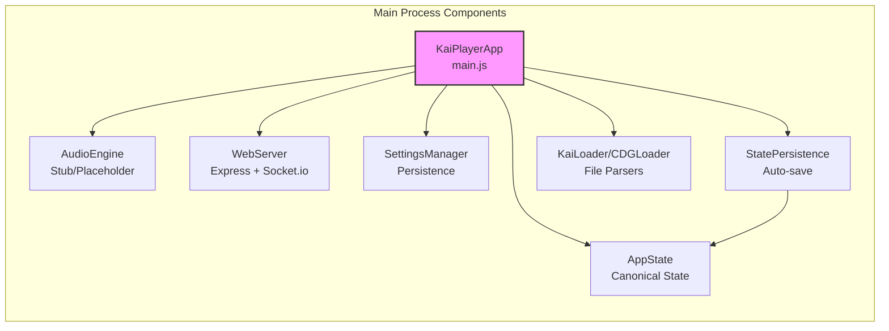
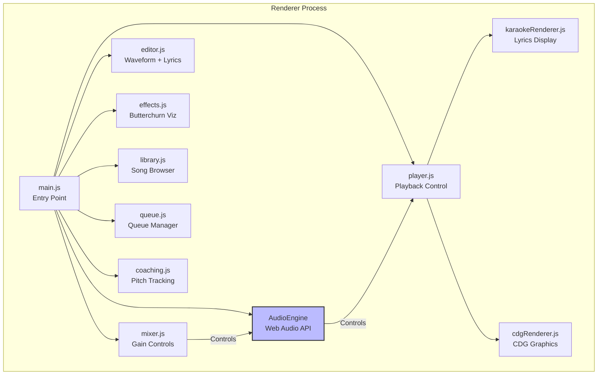
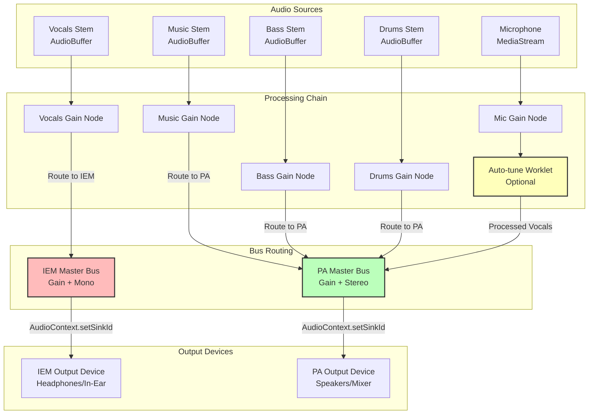

# Kai Player Architecture

## Overview

Kai Player is an innovative karaoke application that uses AI stem separation and dual-output audio routing to provide professional coaching capabilities. The system separates vocals from backing music and routes them to different audio devices - vocals to in-ear monitors (IEM) for the singer, music to PA speakers for the audience.

## System Architecture


## Core Components

### 1. Main Process (Electron/Node.js)

The orchestrator that coordinates all application functionality.



**Key Responsibilities:**
- Window management (main window, canvas window for visualizations)
- File loading and parsing (KAI format, CDG archives)
- Settings persistence and state management
- IPC handler orchestration (100+ channels)
- WebSocket broadcasting to web clients
- Library scanning and song catalog management
- Song queue management

**Major Classes:**
- `KaiPlayerApp` - Main application controller
- `AppState` - EventEmitter-based canonical state model
- `SettingsManager` - JSON file persistence
- `StatePersistence` - Auto-saves state changes
- `WebServer` - Express + Socket.io server (1500+ LOC)
- `KaiLoader` - Parses KAI format (ZIP with Opus stems + lyrics)
- `CDGLoader` - Parses CDG format (MP3 + CDG graphics)

### 2. Renderer Process (Browser/Web Audio API)

Where the magic happens - real-time audio processing and UI.



**Key Responsibilities:**
- Decode audio stems (Opus format via Web Audio API)
- Real-time audio routing (vocals → IEM, music → PA)
- Audio mixing (gain, mute, routing per stem)
- Microphone input with auto-tune processing
- Lyrics rendering (synchronized to audio position)
- CDG rendering (legacy karaoke graphics)
- Waveform visualization for editor
- Pitch tracking and analysis (coaching mode)
- Visual effects (Butterchurn audio visualizer)

### 3. Audio Engine Architecture

The most critical component - dual-output routing with stem separation.



**Audio Flow:**

**Stems (from KAI file):**
- **Vocals** → Individual Gain → **IEM Bus** → Headphones
- **Music/Bass/Drums** → Individual Gain → **PA Bus** → Speakers

**Microphone (singer's live voice):**
- Mic Input → Mic Gain → Auto-tune (optional) → **PA Bus ONLY** → Speakers
- **Never routed to IEM** - Singer should NOT hear their own mic in the monitors

**Master Buses:**
- **IEM Bus:** Mono, routed to in-ear monitors (reference vocals only from stems)
- **PA Bus:** Stereo, routed to main speakers (music + processed live mic)

**Why This Matters:**
- Singer hears **reference vocals** clearly (no music drowning them out)
- Singer does **NOT** hear their own mic (prevents latency, feedback, and distraction)
- Audience hears professional mix (music + live mic, no reference vocals)
- Auto-tune processing only affects what audience hears
- Zero-latency monitoring for singer (pre-recorded stems, not live audio)

### 4. Web Server & Admin Interface

Remote control and song request system with two distinct UIs.


**Web UI Architecture:**

The web interface is split into two distinct applications:

1. **User/Singer UI** - Public-facing interface for audience members
   - Browse song library with search
   - Request songs from catalog
   - View current queue
   - Limited permissions (can't control playback or mixer)

2. **Admin UI** - Full remote control interface for operators
   - All user UI features plus:
   - Mixer control (gain, mute for PA/IEM/Mic)
   - Playback control (play, pause, skip, restart)
   - Approve/reject song requests
   - Queue management (reorder, remove)
   - Server settings configuration
   - Real-time state updates via WebSocket

**REST Endpoints:**
- `POST /login` - User/admin authentication (role-based)
- `GET /settings` - Server configuration (admin only)
- `POST /settings` - Update server settings (admin only)
- `GET /library` - Song catalog with fuzzy search (all users)
- `POST /request` - Request a song (all users)
- `GET /queue` - Current queue (all users)
- `GET /requests` - Pending song requests (admin only)
- `POST /approve` - Approve song request (admin only)
- `POST /reject` - Reject song request (admin only)

**Socket.io Events (Real-time):**
- `playback-state` - Current song position/state
- `song-loaded` - New song loaded
- `queue-update` - Queue changed
- `mixer-update` - Mixer settings changed (admin only)
- `library-updated` - Library rescanned
- `new-request` - New song request notification (admin only)

## Data Flow Examples

### Loading and Playing a Song

```mermaid
sequenceDiagram
    participant User
    participant Renderer
    participant Main
    participant Loader as KaiLoader
    participant Engine as AudioEngine
    participant Device as Audio Devices

    User->>Renderer: Click "Open File"
    Renderer->>Main: IPC: file:openKai
    Main->>User: Show file dialog
    User->>Main: Select song.kai
    Main->>Loader: KaiLoader.load(path)
    Loader->>Loader: Parse ZIP archive
    Loader->>Loader: Extract stems (Opus)
    Loader->>Loader: Extract lyrics.json
    Loader->>Main: Return song data
    Main->>Renderer: IPC: song:data
    Renderer->>Engine: Load stems
    Engine->>Engine: Decode Opus → AudioBuffer
    Engine->>Engine: Create source nodes
    Engine->>Engine: Route vocals → IEM
    Engine->>Engine: Route music → PA
    Engine->>Device: Set sink IDs
    User->>Renderer: Click "Play"
    Renderer->>Engine: play()
    Engine->>Device: Start audio playback
    Device-->>User: Audio output (IEM + PA)
```



### Mixer Control from Web UI


### Song Request Flow


## State Management

### Current State Architecture (Being Refactored)


**AppState Events:**
- `playbackStateChanged` - Position, play/pause state
- `currentSongChanged` - New song loaded
- `queueChanged` - Queue modified
- `mixerChanged` - Mixer settings changed
- `effectsChanged` - Visual effects changed

**Problems (Being Fixed):**
1. State duplicated in renderer (window.audioEngine, window.appInstance)
2. Settings paths inconsistent (device prefs loaded from wrong path)
3. Manual synchronization required between processes
4. No reactive UI updates

## IPC Communication

Over 100 IPC channels organized by domain:


**Channel Categories:**
- `app:*` - App metadata (version, state)
- `file:*` - File operations (open, load, save)
- `audio:*` - Device enumeration, selection, xrun events
- `mixer:*` - Gain, mute, routing controls
- `player:*` - Play, pause, seek
- `autotune:*` - Auto-tune settings
- `song:*` - Song loaded events, data transfer
- `editor:*` - Save edits, reload file
- `window:*` - Canvas window control
- `canvas:*` - Streaming, WebRTC for visualizations
- `library:*` - Folder selection, scanning, search
- `webServer:*` - Web server settings, request management
- `settings:*` - Generic key-value settings
- `queue:*` - Queue management
- `effect:*` - Visual effect events
- `admin:*` - Remote admin commands
- `renderer:*` - Renderer → Main state updates
- `shell:*` - Open external URLs

## File Formats

### KAI Format (Primary)

A custom ZIP archive containing AI-separated stems and synchronized lyrics.

```
song.kai (ZIP archive)
├── vocals.opus       # Vocal stem (Opus codec, ~96kbps)
├── music.opus        # Music stem (Opus codec, ~128kbps)
├── bass.opus         # Bass stem (optional)
├── drums.opus        # Drums stem (optional)
├── other.opus        # Other instruments (optional)
├── lyrics.json       # Timed lyrics with syllable sync
└── metadata.json     # Title, artist, duration, etc.
```

**lyrics.json format:**
```json
{
  "lines": [
    {
      "startTime": 10.5,
      "endTime": 15.2,
      "words": [
        {
          "text": "Hello",
          "startTime": 10.5,
          "endTime": 11.0
        },
        {
          "text": "world",
          "startTime": 11.2,
          "endTime": 11.8
        }
      ]
    }
  ]
}
```

### CDG Format (Legacy Support)

Traditional karaoke format with MP3 audio and graphics.

**Option 1: Loose pair**
```
Artist - Song Title.mp3
Artist - Song Title.cdg
```

**Option 2: Archive**
```
Artist - Song Title.zip
├── audio.mp3
└── graphics.cdg
```

**Metadata Extraction:**
- Filename parsed as "Artist - Title [variant]"
- Artist and title extracted via string split on " - "

## Technology Stack

### Main Process
- **Electron** - Desktop app framework (Chromium + Node.js)
- **Express** - Web server framework
- **Socket.io** - Real-time WebSocket communication
- **yauzl** - ZIP file parsing (streaming)
- **bcrypt** - Password hashing
- **Fuse.js** - Fuzzy search for song library

### Renderer Process
- **Web Audio API** - Real-time audio processing
- **Opus Decoder** - Audio codec for stem files
- **Butterchurn** - Audio visualizer (Milkdrop presets)
- **Vanilla JavaScript** - UI (being migrated to React)
- **Canvas API** - Waveforms, CDG, visual effects

### Web UI (User + Admin)
- **React 18** - UI framework (both UIs)
- **Vite** - Build tool and dev server
- **Socket.io-client** - Real-time communication
- **Fuse.js** - Client-side fuzzy search
- **Role-based UI** - User UI (song requests) + Admin UI (full control)

### Shared (In Progress)
- **ESM Modules** - Universal JavaScript modules
- **Pure Functions** - Audio/format utilities
- **Constants** - IPC channels, defaults

## Current Refactoring Status

### ✅ Phase 1: Main Process ESM Conversion (COMPLETE)
- Converted all CommonJS `require()` to ESM `import`
- Converted all `module.exports` to `export default`
- Added `"type": "module"` to package.json
- Fixed `__dirname` equivalents for ESM
- Eliminated all inline `require()` calls

### ✅ Phase 2.1: Shared Infrastructure (COMPLETE)
- Created `src/shared/` directory
- Created `src/shared/constants.js` (IPC channels, defaults)
- Created `src/shared/utils/audio.js` (dB conversions, stem detection)
- Created `src/shared/utils/format.js` (time/file formatting)

### 🔄 Phase 2.2: Extract Business Logic (NEXT)
- Extract queue management to `src/shared/utils/queue.js`
- Extract song metadata parsing to `src/shared/utils/songMetadata.js`
- Update main.js to import from shared

### 📋 Phase 2.3: Shared State Manager (FUTURE)
- Create `src/shared/state/StateManager.js`
- EventEmitter-based state container
- Works in browser AND Node.js

### 📋 Phase 3-9: React Migration & Unified Business Logic (FUTURE)
- Migrate Electron renderer to React
- Share components between Electron and web UI
- Remove global `window.*` pollution
- **Unified business logic layer** - IPC and REST both call same shared functions
- Consolidate IPC layer
- Break circular dependencies

## Unified Business Logic Architecture

A critical goal is eliminating code duplication between IPC handlers and REST endpoints. Both should call the same underlying business logic.

### Current Problem

```javascript
// IPC Handler (main.js)
ipcMain.handle('queue:addSong', (event, queueItem) => {
  this.songQueue.push(queueItem);
  this.appState.updateQueue(this.songQueue);
  this.webServer.broadcastQueueUpdate(this.songQueue);
  return { success: true };
});

// REST Endpoint (webServer.js) - DUPLICATES THE LOGIC!
app.post('/queue/add', (req, res) => {
  const queueItem = req.body;
  this.songQueue.push(queueItem);
  this.appState.updateQueue(this.songQueue);
  this.io.emit('queue-update', this.songQueue);
  res.json({ success: true });
});
```

### Target Architecture

```javascript
// Shared business logic (src/shared/services/queueService.js)
export class QueueService {
  constructor(appState) {
    this.appState = appState;
  }

  addSong(queueItem) {
    const queue = this.appState.state.queue;
    queue.push(queueItem);
    this.appState.updateQueue(queue);
    return { success: true, queue };
  }

  removeSong(itemId) {
    const queue = this.appState.state.queue;
    const index = queue.findIndex(item => item.id === itemId);
    if (index !== -1) {
      queue.splice(index, 1);
      this.appState.updateQueue(queue);
      return { success: true, queue };
    }
    return { success: false, error: 'Song not found' };
  }
}

// IPC Handler (main.js) - THIN WRAPPER
const queueService = new QueueService(this.appState);

ipcMain.handle('queue:addSong', (event, queueItem) => {
  return queueService.addSong(queueItem);
});

// REST Endpoint (webServer.js) - THIN WRAPPER
app.post('/queue/add', (req, res) => {
  const result = queueService.addSong(req.body);
  res.json(result);
});
```

### Benefits

1. **Business logic in one place** - No duplication between IPC and REST
2. **Easy to test** - Test QueueService once, both interfaces work
3. **Consistent behavior** - IPC and REST guaranteed to behave identically
4. **Maintainable** - Change logic once, both interfaces update
5. **Clear separation** - Transport layer (IPC/REST) vs business logic

### Service Layer Organization

```
src/shared/services/
├── queueService.js       # Queue management (add, remove, reorder)
├── libraryService.js     # Song catalog, search, scanning
├── mixerService.js       # Mixer state management
├── playerService.js      # Playback control
├── requestService.js     # Song request approval/rejection
└── settingsService.js    # Settings CRUD
```

Each service:
- Takes dependencies via constructor (AppState, SettingsManager, etc.)
- Exposes pure business logic methods
- Returns results (no side effects like broadcasting)
- Used by both IPC handlers AND REST endpoints

### Broadcasting Strategy

Services don't broadcast - the caller does:

```javascript
// IPC Handler
ipcMain.handle('queue:addSong', (event, queueItem) => {
  const result = queueService.addSong(queueItem);
  // IPC handler broadcasts to web clients
  if (result.success && this.webServer) {
    this.webServer.io.emit('queue-update', result.queue);
  }
  return result;
});

// REST Endpoint
app.post('/queue/add', (req, res) => {
  const result = queueService.addSong(req.body);
  // REST endpoint broadcasts to all web clients
  if (result.success) {
    this.io.emit('queue-update', result.queue);
  }
  res.json(result);
});
```

This keeps services pure while allowing transport-specific behavior (like broadcasting).

## Architecture Principles

### Current Problems
1. **"Vibe-coded"** - Inconsistent patterns, global state
2. **Code duplication** - IPC and REST duplicate business logic
3. **No shared modules** - Can't share code between renderer/web/main
4. **IPC spaghetti** - 100+ handlers in one file with embedded logic
5. **Multiple state sources** - No single source of truth

### Target Principles
1. **ESM everywhere** - Universal modules (browser + Node.js)
2. **React everywhere** - Shared components between UIs
3. **Single source of truth** - AppState for all state
4. **Dependency injection** - No global `window.*` objects
5. **Unified business logic** - IPC and REST endpoints call same shared functions (no duplication)
6. **Test continuously** - Never break working features

## Performance Considerations

### Audio Engine
- **Dual AudioContext** - Separate contexts for IEM and PA (required for setSinkId)
- **Pre-decoded buffers** - AudioBuffers created once, reused on play
- **Zero-copy routing** - Audio nodes connect directly (no copying)
- **Worklet processing** - Auto-tune runs in audio thread (low latency)

### Web Server
- **Library caching** - Song metadata cached in memory (Fuse.js index)
- **Socket.io broadcasting** - Efficient multi-client updates
- **Debounced state** - Frequent updates batched before broadcast

### File Loading
- **Streaming ZIP parsing** - yauzl reads archives without full extraction
- **Lazy decoding** - Audio stems decoded on-demand
- **Buffer reuse** - Uint8Array transfers for IPC efficiency

## Security Considerations

### Web Server
- **bcrypt password hashing** - No plaintext passwords
- **Session tokens** - Temporary authentication
- **Role-based access** - Singer vs Admin permissions
- **Input validation** - All API inputs sanitized

### Electron
- **Context isolation** (disabled currently) - Should be enabled in future
- **Node integration** (enabled) - Required for audio APIs
- **Content Security Policy** - Should be added

## Future Enhancements

### Short-term (Refactoring)
- Complete ESM migration
- Extract shared business logic
- Create universal StateManager
- Migrate to React UI

### Medium-term (Features)
- Real-time pitch correction visualization
- Multi-user jam sessions (networked)
- Song recommendation engine
- Voice effects (reverb, delay, EQ)

### Long-term (Architecture)
- Automated testing suite
- Plugin architecture for effects
- Cloud sync for libraries
- Mobile app (React Native)
- Advanced audio processing (reverb, delay, compression)

## Innovation Highlights

### What Makes Kai Player Unique

1. **Dual-Output Coaching** - Vocals to IEM, music to PA
   - Professional coaching setup in consumer software
   - No expensive hardware mixer required

2. **AI Stem Separation** - Pre-separated stems in KAI format
   - Zero-latency playback (stems already separated)
   - Perfect synchronization (no real-time ML overhead)

3. **Web-based Song Requests** - Audience participation
   - Singers browse catalog on their phones
   - Host approves/rejects requests
   - No app installation required

4. **Auto-tune Processing** - Real-time pitch correction
   - AudioWorklet for low latency
   - Visual feedback of pitch accuracy
   - Adjustable strength and speed

5. **Unified Architecture** - One codebase, multiple UIs
   - Electron renderer for main interface
   - React web UI for remote control
   - Shared business logic (in progress)

---

## Conclusion

Kai Player represents a novel approach to karaoke technology, combining AI stem separation with professional audio routing typically found in recording studios. While the original codebase suffered from "vibe coding" inconsistencies, the core functionality is innovative and valuable. The ongoing refactoring aims to preserve this innovation while establishing maintainable, scalable architecture for future development.

The dual-output routing (vocals → IEM, music → PA, mic → PA after auto-tune) enables genuine coaching scenarios where singers can hear reference vocals clearly while the audience hears a professional mix. This is the key differentiator that makes Kai Player more than just another karaoke app.
