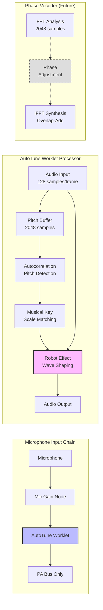
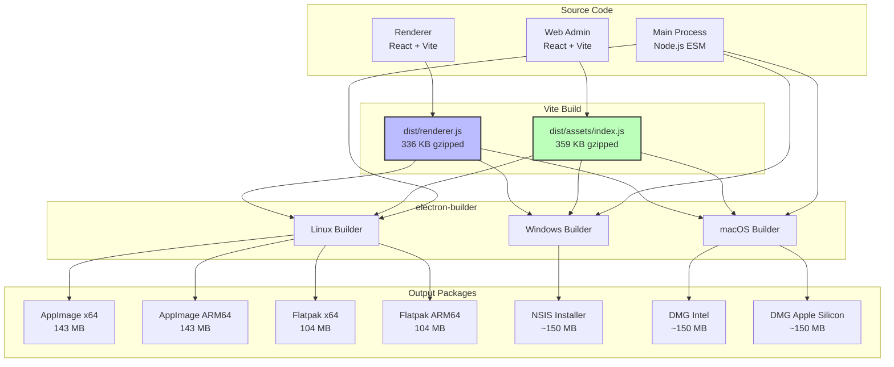

# Kai Player Architecture

## Overview

Kai Player is an innovative karaoke application that uses AI stem separation and dual-output audio routing to provide professional coaching capabilities. The system separates vocals from backing music and routes them to different audio devices - vocals to in-ear monitors (IEM) for the singer, music to PA speakers for the audience.

## System Architecture


## Core Components

### 1. Main Process (Electron/Node.js)

The orchestrator that coordinates all application functionality.


**Key Responsibilities:**
- Window management (main window, canvas window for visualizations)
- File loading and parsing (KAI format, CDG archives)
- Settings persistence and state management
- IPC handler orchestration (100+ channels)
- WebSocket broadcasting to web clients
- Library scanning and song catalog management
- Song queue management

**Major Classes:**
- `KaiPlayerApp` - Main application controller
- `AppState` - EventEmitter-based canonical state model
- `SettingsManager` - JSON file persistence
- `StatePersistence` - Auto-saves state changes
- `WebServer` - Express + Socket.io server (1500+ LOC)
- `KaiLoader` - Parses KAI format (ZIP with Opus stems + lyrics)
- `CDGLoader` - Parses CDG format (MP3 + CDG graphics)

### 2. Renderer Process (React + Web Audio API)

React-based UI with real-time audio processing.


**Key Responsibilities:**
- **React UI Layer**:
  - AppRoot provides contexts (Player, Audio, Settings)
  - Custom hooks manage audio engine, settings persistence, WebRTC
  - Shared components work in both Electron and web admin
  - Renderer wrappers bridge React components to IPC
- **Bridge Pattern**:
  - BridgeInterface defines abstract API
  - ElectronBridge implements for Electron (uses IPC)
  - WebBridge implements for web admin (uses HTTP/Socket.io)
  - Components receive bridge prop, don't know about transport layer
- **Audio Engine** (unchanged vanilla JS):
  - KAIPlayer: KAI format with stem separation
  - CDGPlayer: CDG format with graphics
  - PlayerController: Unified playback control
  - KaraokeRenderer: Canvas rendering + Butterchurn effects

### 3. Player Architecture

Unified interface for multiple karaoke formats with format-specific implementations.


**PlayerInterface Abstraction:**

The `PlayerInterface` base class provides a unified interface for all karaoke formats:

**Abstract Methods (must be implemented):**
- `play()` - Start playback
- `pause()` - Stop playback
- `seek(position)` - Jump to specific time
- `getCurrentPosition()` - Get current playback time
- `getDuration()` - Get total song duration
- `loadSong(songData)` - Load format-specific song data
- `getFormat()` - Return format identifier ('kai', 'cdg', etc.)

**Common Implementations (inherited):**
- `reportStateChange()` - Send position updates to web admin
- `startStateReporting()` - Begin 100ms interval updates
- `stopStateReporting()` - Stop interval updates
- `resetPosition()` - Reset to beginning on song load
- `onSongEnded(callback)` - Register song end handler
- `_triggerSongEnd()` - Invoke song end callback

**Format-Specific Implementations:**

**KAIPlayer (AI-Separated Stems):**
- Decode Opus audio stems (vocals, music, bass, drums)
- **Dual-output routing:**
  - **Vocals** → Individual Gain → **IEM Bus** → Headphones
  - **Music/Bass/Drums** → Individual Gain → **PA Bus** → Speakers
- **Microphone (live voice):**
  - Mic Input → Mic Gain → Auto-tune (optional) → **PA Bus ONLY**
  - **Never routed to IEM** - Singer should NOT hear their own mic
- Two AudioContext instances (IEM device, PA device)
- Zero-latency monitoring for singer (pre-recorded stems)

**CDGPlayer (Legacy Karaoke):**
- Decode MP3 audio
- Render CDG graphics (300x216 pixel canvas)
- **Single-output routing:**
  - MP3 → Gain Node → **PA Bus** → Speakers
- Make CDG background transparent, overlay on Butterchurn effects
- Single AudioContext (PA device only)
- No IEM routing (traditional karaoke mode)

### 4. Polymorphic Player Control

The renderer uses a `currentPlayer` reference to eliminate format branching:

```javascript
// PlayerController sets currentPlayer when loading a song
if (format === 'cdg') {
    this.currentPlayer = this.cdgPlayer;
} else {
    this.currentPlayer = this.kaiPlayer;
}
this.currentPlayer.onSongEnded(() => this.handleSongEnded());

// All playback control uses the same interface (no format checks!)
async togglePlayback() {
    if (this.isPlaying) {
        await this.currentPlayer.pause();
    } else {
        await this.currentPlayer.play();
    }
}

async seek(position) {
    await this.currentPlayer.seek(position);
}

getDuration() {
    return this.currentPlayer.getDuration();
}
```

**Benefits:**
- No `if (format === 'cdg')` checks scattered throughout code
- Adding new formats (e.g., video) just requires extending PlayerInterface
- Type-safe interface ensures all players have same methods
- Bugs fixed once in PlayerInterface benefit all formats

### PlayerFactory

The `PlayerFactory` provides a clean way to instantiate players:

```javascript
// Create player based on format
const player = PlayerFactory.create('cdg', { canvasId: 'karaokeCanvas' });

// Check if format is supported
if (PlayerFactory.isSupported('mp4')) {
    // Video support available
}

// Get all supported formats
const formats = PlayerFactory.getSupportedFormats(); // ['kai', 'cdg']
```

**Factory benefits:**
- Centralized player instantiation
- Automatic validation (checks for required options)
- Helpful error messages for unsupported formats
- Dynamic support detection (checks if MoviePlayer loaded)
- Future-proof (adding formats just updates the factory)

### 5. Auto-Tune System

Real-time pitch correction using AudioWorklet for low-latency processing.

**Architecture:**


**Key Components:**

**1. Pitch Detection (Autocorrelation)**
- Buffer size: 2048 samples (~46ms at 44.1kHz)
- Detection range: 80-800 Hz (vocal range)
- Algorithm: Autocorrelation with period matching
- Output: Detected fundamental frequency

**2. Musical Key System**
- 12 major keys (C, C#, D, ... B)
- Scale-based note snapping
- 5 octaves per note (65Hz - 1760Hz)
- Finds nearest in-scale note to detected pitch

**3. Current Implementation: Robot Effect**
- **Wave Shaping:** Hard clipping + sine shaping
- **Harmonic Distortion:** Creates "robotic" quality
- **Quantization:** 16-level stepped pitch effect
- **Mixing:** Blends original and processed by strength parameter
- **Purpose:** Immediately audible auto-tune effect

**4. Phase Vocoder Architecture (Prepared)**
```javascript
// Structures ready for phase vocoder implementation:
fftSize: 2048           // FFT window size
hopSize: 512            // Overlap factor (4:1)
analysisWindow: Hann    // Analysis window function
synthesisWindow: Hann   // Synthesis window function
inputBuffer: Float32    // Input overlap-add buffer
outputBuffer: Float32   // Output overlap-add buffer
overlapBuffer: Float32  // Synthesis accumulator
```

**Processing Flow:**
1. **Input** - Microphone audio (128 samples/frame)
2. **Buffering** - Accumulate 2048 samples for pitch detection
3. **Pitch Detection** - Autocorrelation finds fundamental frequency
4. **Scale Matching** - Find nearest in-key note
5. **Effect Application** - Robot effect (currently) or phase vocoder (future)
6. **Mixing** - Blend with original based on strength
7. **Output** - To PA bus (never to IEM - singer doesn't hear their own mic)

**Parameters:**
| Parameter | Range | Default | Description |
|-----------|-------|---------|-------------|
| **Enabled** | on/off | off | Master enable switch |
| **Strength** | 0-100% | 50% | Effect intensity (dry/wet mix) |
| **Speed** | 1-100ms | 5ms | Pitch correction speed (smoothing) |
| **Key** | C, C#...B | C | Musical key for scale snapping |

**Implementation Status:**
- ✅ AudioWorklet processor (`autoTuneWorklet.js`)
- ✅ Pitch detection (autocorrelation)
- ✅ Musical key/scale system
- ✅ Robot effect (audible auto-tune)
- ✅ Phase vocoder structures (prepared)
- ⏳ Phase vocoder pitch shifting (future)
- ⏳ Visual pitch feedback (future)

**Performance:**
- Processing: Audio thread (no main thread blocking)
- Latency: < 5ms (worklet processing)
- CPU: Minimal (simple wave shaping)
- Future: Phase vocoder will increase CPU usage but remain real-time

### 6. Web Server & Admin Interface

Remote control and song request system with two distinct UIs.


**Web UI Architecture:**

The web interface is split into two distinct applications:

1. **User/Singer UI** - Public-facing interface for audience members
   - Browse song library with search
   - Request songs from catalog
   - View current queue
   - Limited permissions (can't control playback or mixer)

2. **Admin UI** - Full remote control interface for operators
   - All user UI features plus:
   - Mixer control (gain, mute for PA/IEM/Mic)
   - Playback control (play, pause, skip, restart)
   - Approve/reject song requests
   - Queue management (reorder, remove)
   - Server settings configuration
   - Real-time state updates via WebSocket

**REST Endpoints:**
- `POST /login` - User/admin authentication (role-based)
- `GET /settings` - Server configuration (admin only)
- `POST /settings` - Update server settings (admin only)
- `GET /library` - Song catalog with fuzzy search (all users)
- `POST /request` - Request a song (all users)
- `GET /queue` - Current queue (all users)
- `GET /requests` - Pending song requests (admin only)
- `POST /approve` - Approve song request (admin only)
- `POST /reject` - Reject song request (admin only)

**Socket.io Events (Real-time):**
- `playback-state` - Current song position/state
- `song-loaded` - New song loaded
- `queue-update` - Queue changed
- `mixer-update` - Mixer settings changed (admin only)
- `library-updated` - Library rescanned
- `new-request` - New song request notification (admin only)

## Data Flow Examples

### Loading and Playing a Song

```mermaid
sequenceDiagram
    participant User
    participant Renderer
    participant Main
    participant Loader as KaiLoader
    participant Player as KAIPlayer
    participant Device as Audio Devices

    User->>Renderer: Click "Open File"
    Renderer->>Main: IPC: file:openKai
    Main->>User: Show file dialog
    User->>Main: Select song.kai
    Main->>Loader: KaiLoader.load(path)
    Loader->>Loader: Parse ZIP archive
    Loader->>Loader: Extract stems (Opus)
    Loader->>Loader: Extract lyrics.json
    Loader->>Main: Return song data
    Main->>Renderer: IPC: song:data
    Renderer->>Player: loadSong(songData)
    Player->>Player: Decode Opus → AudioBuffer
    Player->>Player: Create source nodes
    Player->>Player: Route vocals → IEM
    Player->>Player: Route music → PA
    Player->>Device: Set sink IDs
    User->>Renderer: Click "Play"
    Renderer->>Player: play()
    Player->>Device: Start audio playback
    Device-->>User: Audio output (IEM + PA)
```



### Mixer Control from Web UI


### Song Request Flow


## State Management

### Current State Architecture (Being Refactored)


**AppState Events:**
- `playbackStateChanged` - Position, play/pause state
- `currentSongChanged` - New song loaded
- `queueChanged` - Queue modified
- `mixerChanged` - Mixer settings changed
- `effectsChanged` - Visual effects changed

**Problems (Being Fixed):**
1. State duplicated in renderer (window.audioEngine, window.appInstance)
2. Settings paths inconsistent (device prefs loaded from wrong path)
3. Manual synchronization required between processes
4. No reactive UI updates

## IPC Communication

Over 100 IPC channels organized by domain:


**Channel Categories:**
- `app:*` - App metadata (version, state)
- `file:*` - File operations (open, load, save)
- `audio:*` - Device enumeration, selection, xrun events
- `mixer:*` - Gain, mute, routing controls
- `player:*` - Play, pause, seek
- `autotune:*` - Auto-tune settings
- `song:*` - Song loaded events, data transfer
- `editor:*` - Save edits, reload file
- `window:*` - Canvas window control
- `canvas:*` - Streaming, WebRTC for visualizations
- `library:*` - Folder selection, scanning, search
- `webServer:*` - Web server settings, request management
- `settings:*` - Generic key-value settings
- `queue:*` - Queue management
- `effect:*` - Visual effect events
- `admin:*` - Remote admin commands
- `renderer:*` - Renderer → Main state updates
- `shell:*` - Open external URLs

## File Formats

### KAI Format (Primary)

A custom ZIP archive containing AI-separated stems and synchronized lyrics.

```
song.kai (ZIP archive)
├── vocals.opus       # Vocal stem (Opus codec, ~96kbps)
├── music.opus        # Music stem (Opus codec, ~128kbps)
├── bass.opus         # Bass stem (optional)
├── drums.opus        # Drums stem (optional)
├── other.opus        # Other instruments (optional)
├── lyrics.json       # Timed lyrics with syllable sync
└── metadata.json     # Title, artist, duration, etc.
```

**lyrics.json format:**
```json
{
  "lines": [
    {
      "startTime": 10.5,
      "endTime": 15.2,
      "words": [
        {
          "text": "Hello",
          "startTime": 10.5,
          "endTime": 11.0
        },
        {
          "text": "world",
          "startTime": 11.2,
          "endTime": 11.8
        }
      ]
    }
  ]
}
```

### CDG Format (Legacy Support)

Traditional karaoke format with MP3 audio and graphics.

**Option 1: Loose pair**
```
Artist - Song Title.mp3
Artist - Song Title.cdg
```

**Option 2: Archive**
```
Artist - Song Title.zip
├── audio.mp3
└── graphics.cdg
```

**Metadata Extraction:**
- Filename parsed as "Artist - Title [variant]"
- Artist and title extracted via string split on " - "

## Technology Stack

### Main Process
- **Electron 38** - Desktop app framework (Chromium + Node.js)
- **Express 5** - Web server framework
- **Socket.io 4** - Real-time WebSocket communication
- **yauzl 3** - ZIP file parsing (streaming)
- **bcrypt 6** - Password hashing
- **Fuse.js 7** - Fuzzy search for song library

### Renderer Process
- **React 19** - Complete UI framework
- **Vite 7** - Build tool and dev server (lightning-fast HMR)
- **React Context API** - State management (Player, Audio, Settings)
- **Custom Hooks** - Reusable logic (audio engine, settings, WebRTC)
- **Web Audio API** - Real-time audio processing
- **Opus Decoder** - Audio codec for stem files
- **Butterchurn 2** - Audio visualizer (Milkdrop presets)
- **Canvas API** - Waveforms, CDG, visual effects

### Web UI (User + Admin)
- **React 19** - UI framework (both UIs)
- **Vite 7** - Build tool and dev server
- **Socket.io-client 4** - Real-time communication
- **Fuse.js 7** - Client-side fuzzy search
- **Role-based UI** - User UI (song requests) + Admin UI (full control)
- **WebBridge** - HTTP/Socket.io adapter implementing BridgeInterface

### Shared Components & Logic
- **ESM Modules** - Universal JavaScript modules
- **Bridge Pattern** - BridgeInterface, ElectronBridge, WebBridge
- **Shared Components** - LibraryPanel, EffectsPanel, QuickSearch, etc.
- **Service Layer** - effectsService, playerService, settingsService
- **Pure Functions** - Audio/format utilities
- **Constants** - IPC channels, defaults

### Build & Packaging
- **electron-builder 26** - Multi-platform packaging
- **Vite 7** - Asset bundling (renderer + web)
- **GitHub Actions** - Automated CI/CD
- **QEMU** - ARM64 cross-compilation on x64
- **Flatpak** - Sandboxed Linux distribution

## Refactoring Status

### ✅ Phase 1: Main Process ESM Conversion (COMPLETE)
- Converted all CommonJS `require()` to ESM `import`
- Converted all `module.exports` to `export default`
- Added `"type": "module"` to package.json
- Fixed `__dirname` equivalents for ESM
- Eliminated all inline `require()` calls

### ✅ Phase 2: Shared Infrastructure (COMPLETE)
- Created `src/shared/` directory structure
- Created `src/shared/constants.js` (IPC channels, defaults)
- Created `src/shared/utils/audio.js` (dB conversions, stem detection)
- Created `src/shared/utils/format.js` (time/file formatting)
- Created service layer (effectsService, playerService, settingsService)
- Shared components (LibraryPanel, EffectsPanel, QuickSearch, VisualizationSettings)

### ✅ Phase 3: React Migration (COMPLETE)
- Migrated Electron renderer from vanilla JS to React
- Created React contexts (PlayerContext, AudioContext, SettingsContext)
- Created custom hooks (useAudioEngine, useSettingsPersistence, useWebRTC)
- Component-based architecture with proper separation of concerns
- Removed global `window.*` pollution (except for audio engine integration)

### ✅ Phase 4: Bridge Pattern (COMPLETE)
- Created BridgeInterface abstract base class
- Implemented ElectronBridge (IPC-based)
- Implemented WebBridge (HTTP/Socket.io-based)
- Shared components work seamlessly in both Electron and web admin
- Complete transport layer abstraction

### ✅ Phase 5: Unified Business Logic (IN PROGRESS)
- **Completed:**
  - effectsService.js - Effects management shared by IPC and REST
  - playerService.js - Playback control shared by IPC and REST
  - settingsService.js - Settings CRUD shared by IPC and REST
- **Remaining:**
  - Complete migration of all IPC handlers to use service layer
  - Extract queue management to queueService.js
  - Extract library scanning to libraryService.js

### 📋 Phase 6: Testing & Polish (FUTURE)
- Automated testing suite
- Performance optimization
- Error handling improvements
- Documentation updates

## Bridge Pattern Architecture

A key architectural improvement is the Bridge Pattern, which abstracts the transport layer from UI components.

### Bridge Interface

All bridges implement the same interface, allowing shared components to work in both Electron and web environments:

```typescript
interface BridgeInterface {
  // Player controls
  play(): Promise<void>
  pause(): Promise<void>
  seek(position: number): Promise<void>
  next(): Promise<void>
  restart(): Promise<void>

  // Library & search
  searchSongs(query: string): Promise<{songs: Array}>
  getSongsFolder(): Promise<string>
  setSongsFolder(): Promise<void>

  // Queue management
  addToQueue(item: QueueItem): Promise<void>
  removeFromQueue(id: string): Promise<void>
  getQueue(): Promise<Array<QueueItem>>

  // Effects control
  selectEffect(name: string): Promise<void>
  enableEffect(name: string): Promise<void>
  disableEffect(name: string): Promise<void>

  // Settings
  getWaveformPreferences(): Promise<object>
  saveWaveformPreferences(prefs: object): Promise<void>

  // ... and more
}
```

### ElectronBridge (IPC-based)

Used in the Electron renderer process:

```javascript
export class ElectronBridge {
  async play() {
    return await window.kaiAPI.player.play();
  }

  async searchSongs(query) {
    return await window.kaiAPI.library.search(query);
  }

  async addToQueue(item) {
    return await window.kaiAPI.queue.addSong(item);
  }

  async selectEffect(name) {
    return await window.kaiAPI.effects.select(name);
  }
}
```

### WebBridge (HTTP + Socket.io)

Used in the web admin interface:

```javascript
export class WebBridge {
  constructor(baseUrl = '/admin') {
    this.baseUrl = baseUrl;
    this.socket = io('/admin');
  }

  async play() {
    await this._fetch('/playback/play', { method: 'POST' });
  }

  async searchSongs(query) {
    return await this._fetch(`/library/search?q=${query}`);
  }

  async addToQueue(item) {
    await this._fetch('/queue/add', {
      method: 'POST',
      body: JSON.stringify(item)
    });
  }

  async selectEffect(name) {
    await this._fetch('/effects/select', {
      method: 'POST',
      body: JSON.stringify({ effectName: name })
    });
  }
}
```

### Shared Components

Components receive a `bridge` prop and work identically in both environments:

```javascript
export function LibraryPanel({ bridge }) {
  const [songs, setSongs] = useState([]);

  const handleSearch = async (query) => {
    // Works with BOTH ElectronBridge and WebBridge!
    const result = await bridge.searchSongs(query);
    setSongs(result.songs);
  };

  const handleAddToQueue = async (song) => {
    // Transport-agnostic - bridge handles IPC vs HTTP
    await bridge.addToQueue({
      path: song.path,
      title: song.title,
      artist: song.artist
    });
  };

  return (
    <div>
      <SearchInput onSearch={handleSearch} />
      <SongList songs={songs} onAdd={handleAddToQueue} />
    </div>
  );
}
```

### Benefits

1. **Code Reuse** - Write component once, works in Electron and web
2. **Transport Agnostic** - Components don't care about IPC vs HTTP
3. **Testability** - Easy to mock bridge for testing
4. **Type Safety** - Interface ensures consistency
5. **Maintainability** - Change transport layer without touching components

## Unified Business Logic Architecture

A critical goal is eliminating code duplication between IPC handlers and REST endpoints. Both should call the same underlying business logic.

### Current Problem

```javascript
// IPC Handler (main.js)
ipcMain.handle('queue:addSong', (event, queueItem) => {
  this.songQueue.push(queueItem);
  this.appState.updateQueue(this.songQueue);
  this.webServer.broadcastQueueUpdate(this.songQueue);
  return { success: true };
});

// REST Endpoint (webServer.js) - DUPLICATES THE LOGIC!
app.post('/queue/add', (req, res) => {
  const queueItem = req.body;
  this.songQueue.push(queueItem);
  this.appState.updateQueue(this.songQueue);
  this.io.emit('queue-update', this.songQueue);
  res.json({ success: true });
});
```

### Target Architecture

```javascript
// Shared business logic (src/shared/services/queueService.js)
export function addSong(appState, queueItem) {
  const queue = appState.state.queue;
  queue.push(queueItem);
  appState.updateQueue(queue);
  return { success: true, queue };
}

export function removeSong(appState, itemId) {
  const queue = appState.state.queue;
  const index = queue.findIndex(item => item.id === itemId);
  if (index !== -1) {
    queue.splice(index, 1);
    appState.updateQueue(queue);
    return { success: true, queue };
  }
  return { success: false, error: 'Song not found' };
}

export function reorderQueue(appState, fromIndex, toIndex) {
  const queue = appState.state.queue;
  const [item] = queue.splice(fromIndex, 1);
  queue.splice(toIndex, 0, item);
  appState.updateQueue(queue);
  return { success: true, queue };
}

// IPC Handler (main.js) - THIN WRAPPER
ipcMain.handle('queue:addSong', (event, queueItem) => {
  return addSong(this.appState, queueItem);
});

ipcMain.handle('queue:removeSong', (event, itemId) => {
  return removeSong(this.appState, itemId);
});

// REST Endpoint (webServer.js) - THIN WRAPPER
app.post('/queue/add', (req, res) => {
  const result = addSong(this.appState, req.body);
  res.json(result);
});

app.delete('/queue/:itemId', (req, res) => {
  const result = removeSong(this.appState, req.params.itemId);
  res.json(result);
});
```

### Benefits

1. **Business logic in one place** - No duplication between IPC and REST
2. **Easy to test** - Test QueueService once, both interfaces work
3. **Consistent behavior** - IPC and REST guaranteed to behave identically
4. **Maintainable** - Change logic once, both interfaces update
5. **Clear separation** - Transport layer (IPC/REST) vs business logic

### Service Layer Organization

```
src/shared/services/
├── queueService.js       # Queue management (add, remove, reorder)
├── libraryService.js     # Song catalog, search, scanning
├── mixerService.js       # Mixer state management
├── playerService.js      # Playback control
├── requestService.js     # Song request approval/rejection
└── settingsService.js    # Settings CRUD
```

Each service module:
- Exports pure functions (no classes needed)
- Takes dependencies as function parameters (AppState, etc.)
- Returns results (no side effects like broadcasting)
- Used by both IPC handlers AND REST endpoints
- Simple, testable, functional approach

### Broadcasting Strategy

Service functions don't broadcast - the caller does:

```javascript
// IPC Handler
ipcMain.handle('queue:addSong', (event, queueItem) => {
  const result = addSong(this.appState, queueItem);
  // IPC handler broadcasts to web clients
  if (result.success && this.webServer) {
    this.webServer.io.emit('queue-update', result.queue);
  }
  return result;
});

// REST Endpoint
app.post('/queue/add', (req, res) => {
  const result = addSong(this.appState, req.body);
  // REST endpoint broadcasts to all web clients
  if (result.success) {
    this.io.emit('queue-update', result.queue);
  }
  res.json(result);
});
```

This keeps service functions pure while allowing transport-specific behavior (like broadcasting).

## Architecture Principles

### ✅ Achieved Principles
1. **ESM everywhere** - Universal modules work in browser + Node.js
2. **React everywhere** - Shared components between Electron and web UI
3. **Bridge Pattern** - Transport layer abstraction (IPC vs HTTP)
4. **Service Layer** - Shared business logic (effectsService, playerService, etc.)
5. **React Context API** - Proper state management (no global pollution)
6. **Custom Hooks** - Reusable logic (useAudioEngine, useSettingsPersistence)

### 🔄 In Progress
1. **Complete service extraction** - All IPC handlers use service layer
2. **Settings persistence** - Fully working with proper load order
3. **Effects system** - Bidirectional sync between renderer and web admin
4. **WebRTC streaming** - Canvas window with proper IPC handlers

### 📋 Future Goals
1. **Automated testing** - Unit tests for service layer
2. **TypeScript migration** - Type safety across codebase
3. **Performance optimization** - Profile and improve bottlenecks
4. **Error boundaries** - React error handling
5. **Plugin system** - Extensible effects and features

## Performance Considerations

### Audio Engine
- **Dual AudioContext** - Separate contexts for IEM and PA (required for setSinkId)
- **Pre-decoded buffers** - AudioBuffers created once, reused on play
- **Zero-copy routing** - Audio nodes connect directly (no copying)
- **Worklet processing** - Auto-tune runs in audio thread (low latency)

### Web Server
- **Library caching** - Song metadata cached in memory (Fuse.js index)
- **Socket.io broadcasting** - Efficient multi-client updates
- **Debounced state** - Frequent updates batched before broadcast

### File Loading
- **Streaming ZIP parsing** - yauzl reads archives without full extraction
- **Lazy decoding** - Audio stems decoded on-demand
- **Buffer reuse** - Uint8Array transfers for IPC efficiency

## Security Considerations

### Web Server
- **bcrypt password hashing** - No plaintext passwords
- **Session tokens** - Temporary authentication
- **Role-based access** - Singer vs Admin permissions
- **Input validation** - All API inputs sanitized

### Electron
- **Context isolation** (disabled currently) - Should be enabled in future
- **Node integration** (enabled) - Required for audio APIs
- **Content Security Policy** - Should be added

## Future Enhancements

### Short-term (Refactoring)
- Complete ESM migration
- Extract shared business logic
- Create universal StateManager
- Migrate to React UI

### Medium-term (Features)
- Real-time pitch correction visualization
- Multi-user jam sessions (networked)
- Song recommendation engine
- Voice effects (reverb, delay, EQ)

### Long-term (Architecture)
- Automated testing suite
- Plugin architecture for effects
- Cloud sync for libraries
- Mobile app (React Native)
- Advanced audio processing (reverb, delay, compression)

## Innovation Highlights

### What Makes Kai Player Unique

1. **Dual-Output Coaching** - Vocals to IEM, music to PA
   - Professional coaching setup in consumer software
   - No expensive hardware mixer required

2. **AI Stem Separation** - Pre-separated stems in KAI format
   - Zero-latency playback (stems already separated)
   - Perfect synchronization (no real-time ML overhead)

3. **Web-based Song Requests** - Audience participation
   - Singers browse catalog on their phones
   - Host approves/rejects requests
   - No app installation required

4. **Auto-tune Processing** - Real-time pitch correction with phase vocoder
   - **AudioWorklet Implementation** - Low-latency processing in audio thread
   - **Pitch Detection** - Autocorrelation algorithm (80-800 Hz range)
   - **Musical Key Support** - 12 major keys with scale-based pitch snapping
   - **Phase Vocoder Architecture** - FFT-based pitch shifting with overlap-add
     - FFT size: 2048 samples
     - Hop size: 512 samples (4:1 overlap)
     - Hann windowing for analysis and synthesis
   - **Current Implementation** - Robot effect for audible feedback
     - Wave shaping with harmonic distortion
     - Quantization for stepped pitch effect
     - Adjustable strength (0-100%) and speed (1-100ms)
   - **Future Enhancement** - True phase vocoder pitch shifting
   - **Controls** - Enable/disable, strength, speed, musical key selection

5. **Unified Architecture** - One codebase, multiple UIs
   - Electron renderer for main interface
   - React web UI for remote control
   - Shared business logic (in progress)

---

## Recent Major Accomplishments (2024)

### Complete React Migration
- **100% React UI** - Migrated entire Electron renderer from vanilla JavaScript to React
- **Context API Integration** - Proper state management with PlayerContext, AudioContext, SettingsContext
- **Custom Hooks** - Reusable logic extracted to hooks (useAudioEngine, useSettingsPersistence, useWebRTC, useKeyboardShortcuts)
- **Component Architecture** - Clean separation between shared components and renderer-specific wrappers

### Bridge Pattern Implementation
- **BridgeInterface** - Abstract base class defining common API
- **ElectronBridge** - IPC-based implementation for Electron renderer
- **WebBridge** - HTTP/Socket.io implementation for web admin
- **Shared Components** - LibraryPanel, EffectsPanel, QuickSearch, VisualizationSettings work in both environments
- **Zero Duplication** - Same React components used in Electron and web admin

### Service Layer Architecture
- **effectsService.js** - Shared effects management logic
- **playerService.js** - Shared playback control logic
- **settingsService.js** - Shared settings CRUD logic
- **Thin Handlers** - IPC and REST endpoints are thin wrappers calling service layer
- **Single Source of Truth** - Business logic in one place, no duplication

### Effects System Overhaul
- **Full Butterchurn Integration** - 100+ visual presets with categories
- **Bidirectional Sync** - Current effect syncs between renderer and web admin
- **Enable/Disable** - Per-effect enable/disable with persistence
- **Next/Previous/Random** - Full control from both renderer and web admin
- **IPC Response Pattern** - Proper request-response for effects list (serializable metadata only)

### Settings Persistence Fixed
- **Load Order** - Settings load before React effects run
- **Debounced Saves** - 1-second debounce prevents excessive writes
- **Proper Initialization** - `isLoadedRef` prevents premature saves on mount
- **Full Persistence** - Waveform preferences, disabled effects, device settings all persist correctly

### WebRTC Canvas Window
- **canvas-app.js** - Proper module for canvas window receiver
- **IPC Handlers** - Full WebRTC command handling (setupReceiver, setOffer, etc.)
- **Main Window IPC** - useWebRTC hook registers sender IPC handlers
- **No Controls** - Video element for WebRTC display but no visible controls
- **Click to Fullscreen** - Canvas click toggles fullscreen mode

### Code Quality Improvements
- **.gitignore** - Build artifacts (dist folders) excluded from git
- **No Code Duplication** - QuickSearch extracted to shared component
- **Bridge Abstraction** - No direct `window` globals except where necessary (audio engine)
- **Clean Logging** - Debug logging removed after fixes verified

## Build & Packaging Architecture

### Overview

Loukai uses **electron-builder 26** for cross-platform packaging with comprehensive multi-architecture support. The build system produces 7 distributable packages across 3 platforms.

### Build Pipeline



### Platform Configuration

#### Linux (electron-builder)

**Targets:**
- **AppImage** (x64, ARM64) - Universal Linux binary
- **Flatpak** (x64, ARM64) - Sandboxed distribution

**Configuration** (package.json:106-141):
```json
{
  "linux": {
    "target": [
      { "target": "AppImage", "arch": ["x64", "arm64"] },
      { "target": "flatpak", "arch": ["x64", "arm64"] }
    ],
    "icon": "static/images/logo.png",
    "category": "AudioVideo"
  },
  "flatpak": {
    "runtime": "org.freedesktop.Platform",
    "runtimeVersion": "24.08",
    "sdk": "org.freedesktop.Sdk",
    "base": "org.electronjs.Electron2.BaseApp",
    "baseVersion": "24.08",
    "finishArgs": [
      "--socket=wayland", "--socket=x11",
      "--share=ipc", "--device=dri",
      "--socket=pulseaudio", "--filesystem=home",
      "--share=network",
      "--talk-name=org.freedesktop.Notifications"
    ]
  }
}
```

**Flatpak Dependencies:**
- Runtime: `org.freedesktop.Platform/24.08`
- SDK: `org.freedesktop.Sdk/24.08`
- Base: `org.electronjs.Electron2.BaseApp/24.08`
- Available for: x64, aarch64 (ARM64)

**Build Requirements:**
```bash
# Install flatpak-builder
sudo apt-get install flatpak-builder flatpak

# Add Flathub remote
flatpak remote-add --user --if-not-exists flathub \
  https://flathub.org/repo/flathub.flatpakrepo

# Install runtimes (both architectures)
flatpak install --user -y flathub \
  org.electronjs.Electron2.BaseApp/x86_64/24.08 \
  org.freedesktop.Platform/x86_64/24.08 \
  org.freedesktop.Sdk/x86_64/24.08 \
  org.electronjs.Electron2.BaseApp/aarch64/24.08 \
  org.freedesktop.Platform/aarch64/24.08 \
  org.freedesktop.Sdk/aarch64/24.08
```

#### Windows (electron-builder)

**Target:**
- **NSIS Installer** (x64) - Installable exe with auto-updater

**Configuration** (package.json:143-146):
```json
{
  "win": {
    "target": "nsis",
    "icon": "static/images/logo.png"
  }
}
```

**Features:**
- Auto-updater support (GH_TOKEN)
- Native bcrypt compilation
- Windows-specific file associations

#### macOS (electron-builder)

**Targets:**
- **DMG** (x64 - Intel Macs)
- **DMG** (ARM64 - Apple Silicon)

**Configuration** (package.json:147-158):
```json
{
  "mac": {
    "target": [
      { "target": "dmg", "arch": ["x64", "arm64"] }
    ],
    "icon": "static/images/logo.png"
  }
}
```

**Features:**
- Universal binary support
- Code signing ready (requires certificates)
- macOS-specific entitlements

### Multi-Architecture Cross-Compilation

#### ARM64 AppImage (via QEMU)

electron-builder uses **QEMU user-mode emulation** to build ARM64 binaries on x64 hosts:

```bash
# Install QEMU
sudo apt-get install -y qemu-user-static

# electron-builder automatically:
# 1. Downloads Electron ARM64 binary
# 2. Uses @electron/rebuild to compile bcrypt for ARM64
# 3. Packages into ARM64 AppImage
```

**Native Module Compilation:**
```
• executing @electron/rebuild  electronVersion=38.2.2 arch=arm64
• installing native dependencies  arch=arm64
• preparing       moduleName=bcrypt arch=arm64
• finished        moduleName=bcrypt arch=arm64
```

#### ARM64 Flatpak (Native Runtimes)

Flatpak ARM64 builds use **native ARM64 runtimes** from Flathub:

- `org.electronjs.Electron2.BaseApp/aarch64/24.08`
- `org.freedesktop.Platform/aarch64/24.08`
- `org.freedesktop.Sdk/aarch64/24.08`

No QEMU needed - flatpak-builder handles cross-compilation internally.

### GitHub Actions CI/CD

**Workflow** (.github/workflows/build.yml):

```yaml
jobs:
  build-linux:     # Ubuntu x64 runner
  build-windows:   # Windows x64 runner
  build-macos:     # macOS x64 runner (builds both architectures)
  release:         # Creates GitHub release with all artifacts
```

**Linux Build Steps:**
1. Install Node.js 18
2. Install dependencies (`npm ci`)
3. Install flatpak-builder + Flatpak
4. Add Flathub remote
5. Install Flatpak runtimes (x64 + ARM64)
6. Install QEMU for ARM64 emulation
7. Run `npm run build:linux`
8. Upload artifacts (*.AppImage, *.flatpak)

**Windows Build Steps:**
1. Install Node.js 18
2. Install dependencies (`npm ci`)
3. Run `npm run build:win`
4. Upload artifact (*.exe)

**macOS Build Steps:**
1. Install Node.js 18
2. Install dependencies (`npm ci`)
3. Run `npm run build:mac`
4. Upload artifacts (*.dmg x2)

**Release Step:**
- Downloads all artifacts from previous jobs
- Creates GitHub release with tag
- Attaches all 7 packages to release

### Build Output Summary

| Platform | Format | Architecture | Size | Build Time |
|----------|--------|--------------|------|------------|
| Linux | AppImage | x64 | 143 MB | ~45s |
| Linux | AppImage | ARM64 | 143 MB | ~60s (QEMU) |
| Linux | Flatpak | x64 | 104 MB | ~90s |
| Linux | Flatpak | ARM64 | 104 MB | ~90s |
| Windows | NSIS | x64 | ~150 MB | ~60s |
| macOS | DMG | x64 | ~150 MB | ~50s |
| macOS | DMG | ARM64 | ~150 MB | ~50s |

**Total:** 7 packages, ~900 MB combined

### Vite Build Configuration

#### Renderer Process (src/renderer/vite.config.js)

```javascript
export default {
  build: {
    outDir: '../../dist',
    rollupOptions: {
      input: {
        renderer: 'src/renderer/index.html'
      }
    }
  }
}
```

**Output:**
- `dist/renderer.js` - 336 KB (93 KB gzipped)
- `dist/renderer.css` - 42 KB (7 KB gzipped)
- `dist/renderer.woff2` - 129 KB (fonts)
- `dist/assets/*.js` - Code-split chunks

#### Web Admin (src/web/vite.config.js)

```javascript
export default {
  build: {
    outDir: '../../dist/web',
    rollupOptions: {
      input: {
        index: 'src/web/index.html'
      }
    }
  }
}
```

**Output:**
- `dist/assets/index.js` - 359 KB (100 KB gzipped)
- `dist/assets/index.css` - 45 KB (7 KB gzipped)
- `dist/index.html` - Entry point

### Dependencies & Bundle Size

**Production Dependencies:**
- React 19 + React-DOM - ~200 KB (biggest dependency)
- Socket.IO Client 4 - ~50 KB
- Butterchurn + Presets - ~100 KB
- Audio worklets + utilities - ~50 KB

**Native Dependencies:**
- bcrypt 6 - Requires compilation for each architecture
- Rebuilt via @electron/rebuild for Electron compatibility

**Bundle Optimization:**
- Code splitting via dynamic imports
- Tree shaking (Vite default)
- Minification + gzip compression
- Lazy loading of Butterchurn presets

### Testing Build Locally

```bash
# Full build for current platform
npm run build:linux    # Linux (AppImage + Flatpak)
npm run build:win      # Windows (NSIS)
npm run build:mac      # macOS (DMG x2)

# Build output location
ls -lh dist/
```

**Verification:**
```bash
# Test AppImage
chmod +x dist/Loukai-1.0.0.AppImage
./dist/Loukai-1.0.0.AppImage

# Test Flatpak
flatpak install --user dist/Loukai-1.0.0-x86_64.flatpak
flatpak run com.loukai.app

# Test on Windows
dist/Loukai-Setup-1.0.0.exe

# Test on macOS
open dist/Loukai-1.0.0.dmg
```

## Conclusion

Kai Player has evolved from a "vibe-coded" prototype into a well-architected, maintainable application. The recent React migration and bridge pattern implementation represent a major architectural milestone, enabling true code sharing between Electron and web interfaces.

The dual-output routing (vocals → IEM, music → PA, mic → PA after auto-tune) remains the key innovation that enables genuine coaching scenarios. With the new architecture in place, adding features, fixing bugs, and extending functionality is now significantly easier and more reliable.

**Key Achievements:**
- **Maintainable** - Clean separation of concerns, shared components, service layer
- **Testable** - Pure functions, dependency injection, mockable bridges
- **Scalable** - Add new features without duplicating code
- **Consistent** - Same business logic for IPC and REST endpoints
- **Modern** - React 19, Vite 7, Electron 38, ESM modules
- **Distributable** - 7 packages across Linux, Windows, macOS (x64 + ARM64)

The foundation is now solid for future enhancements like automated testing, TypeScript migration, and advanced features.
